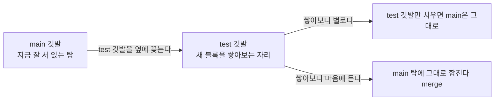
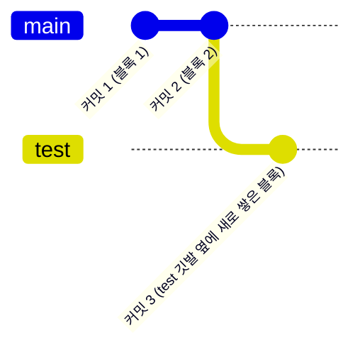
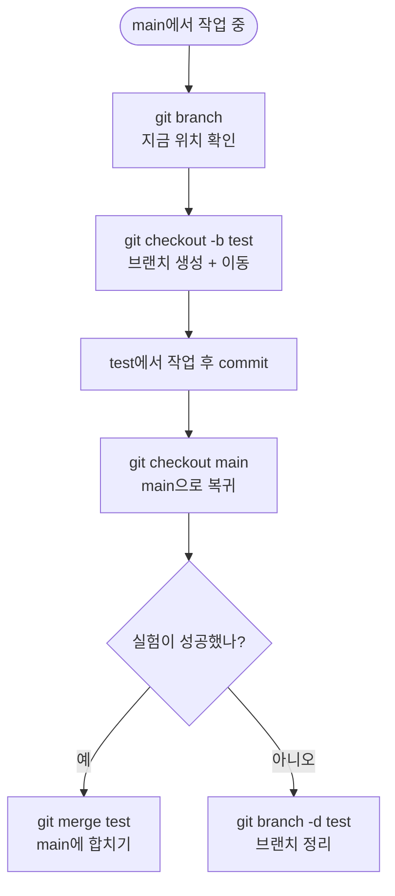

안녕, 오늘은 지난번 merge 글에서 살짝 다뤘던 **브랜치(branch)**를
제대로 짚고 넘어가자. merge와 충돌은 결국 브랜치를 이해해야
자연스럽게 이해되는 개념이거든.

## 1. 브랜치가 왜 필요할까?

지금까지는 커밋을 **나무 블록을 하나씩 쌓아 올린 탑**이라고 생각해보자.
지금 블로그는 이 탑이 흔들림 없이 잘 서 있는 상태야. 맨 위 블록에는
"메인"이라는 깃발이 꽂혀 있고, 다들 그 탑을 보고 "지금 배포된 블로그"라고
믿고 있어.

그런데 어느 날 이런 마음이 생겨.

* 지금 탑(블로그)은 잘 서 있는데, **새로운 디자인을 실험**해보고 싶다.
* 근데 실험하다가 블록을 잘못 쌓으면, **원래 탑은 그대로 서 있어야** 한다.

탑 위에서 바로 새 블록을 쌓기 시작하면, 실패했을 때 탑 전체가 흔들릴
수도 있겠지. 그래서 우리는 깃발을 하나 더 준비해. 이름은 "test"야.
메인 깃발은 지금 있는 자리에 그대로 두고, test 깃발만 옆으로 들고 가서
그 자리에서만 새 블록을 쌓아보는 거야. 실험이 탑 전체를 흔들 필요가
없어지는 거지. 이게 바로 브랜치야 — **원래 작업(main)은 건드리지 않고,
별도의 가지를 만들어서 그 안에서만 실험하는 것.**



## 2. 브랜치는 커밋 목록 위의 "이름표"

여기서 흔히 하는 오해가 하나 있어. "브랜치를 만든다"는 말을 들으면
꼭 **탑을 통째로 복사해서 하나 더 세우는 것**처럼 들리지? 그런데
실제로는 전혀 아니야. 브랜치는 새 탑을 세우는 게 아니라, **이미 쌓여
있는 블록 중 하나에 깃발을 하나 더 꽂는 것**에 가까워. `main`도
`test`도, 사실은 커밋(블록) 목록 위에 붙은 이름표일 뿐이야.



* `main` 깃발은 여전히 "블록 2" 자리에 꽂혀 있어. 움직이지 않았어.
* `test` 깃발은 새로 쌓은 "블록 3" 자리로 옮겨갔어.
* main에서 손댄 게 아무것도 없으니, main은 블록 3의 영향을 전혀 받지 않아.
* 즉 블록이 두 벌이 된 게 아니라, **같은 블록 더미를 서로 다른 깃발이
  가리키고 있을 뿐**이야. 그래서 브랜치를 만들고 이동하는 게 무겁지
  않고 순식간에 끝나는 거야 — 복사할 게 없으니까.

## 3. 명령어 정리

| 명령어 | 언제 쓰나 |
|---|---|
| `git branch` | 지금 어떤 브랜치들이 있는지, 지금 내가 어디에 있는지 보고 싶을 때 |
| `git branch <이름>` | 지금 위치에서 새 브랜치만 만들고 싶을 때 (이동은 안 함) |
| `git checkout <이름>` | 이미 있는 브랜치로 이동하고 싶을 때 |
| `git checkout -b <이름>` | 새 브랜치를 만들면서 바로 그 브랜치로 이동하고 싶을 때 |
| `git branch -d <이름>` | 다 쓴 브랜치를 정리(삭제)하고 싶을 때 |

## 4. 실습 흐름으로 보기

```
git branch          # 지금 브랜치 목록 확인 (* 표시가 지금 위치)
git checkout -b test  # test 브랜치 생성 + 이동
git add .
git commit -m "새 디자인 시도"
git checkout main    # 다시 main으로 복귀
```



## 5. 주의할 점

브랜치를 이동(`checkout`)하기 전에는 지금 작업 중인 내용을
**커밋하거나 정리**해두는 게 좋아. 저장하지 않은 변경 사항이 남은
채로 다른 브랜치로 넘어가면 헷갈리는 상황이 생길 수 있어.

| 상황 | 해야 할 일 |
|---|---|
| 브랜치를 옮기기 전, 수정 중인 파일이 있다 | 먼저 `git add` + `git commit`으로 정리하고 이동 |
| 실험이 끝났고 더 이상 필요 없는 브랜치가 있다 | `git branch -d`로 정리해서 목록을 깔끔하게 유지 |

## 6. STAR 기법으로 정리해보는 예시

지금까지는 브랜치 자체를 설명했다면, 이번엔 **내가 겪은 상황을
글로 풀어내는 방법**도 하나 알아두면 좋아. 개발 블로그에서 자주
쓰는 방식이 **STAR 기법**이야. 상황(S) → 과제(T) → 행동(A) → 결과(R)
순서로 경험을 정리하는 거지.

| 단계 | 의미 | 예시 |
|---|---|---|
| **S**ituation (상황) | 어떤 배경이었나 | "블로그 디자인을 바꿔보고 싶었는데, 실패하면 지금 배포된 블로그가 망가질까봐 걱정됐다." |
| **T**ask (과제) | 무엇을 해결해야 했나 | "원래 블로그(main)는 그대로 두고, 안전하게 새 디자인을 실험할 방법이 필요했다." |
| **A**ction (행동) | 어떻게 했나 | "`git checkout -b test`로 test 브랜치를 만들어 그 안에서만 수정하고 커밋했다." |
| **R**esult (결과) | 결과와 배운 점 | "실험이 마음에 들지 않아 `git branch -d test`로 지웠고, main은 커밋 한 번 건드리지 않아 안전했다. 브랜치가 '복사'가 아니라 '이름표'라는 걸 몸으로 이해했다." |

> 위 내용은 이해를 돕기 위한 **예시**야. 나중에 진짜로 브랜치를 쓰다가
> 겪은 상황(예: 충돌이 났던 경험, 브랜치를 잘못 지워서 당황했던 순간
> 등)이 생기면, 그 실제 경험을 S-T-A-R 순서에 맞게 채워보는 연습을
> 해보면 좋아.

## 7. 오늘의 정리

브랜치는 "복사본을 새로 만드는 것"이 아니라, **커밋 위에 붙이는
이름표를 하나 더 만드는 것**이야. 그래서 만들고 이동하는 게 가볍고
빠르고, 잘못되면 그냥 지워버리면 그만이야. 다음에 merge하다가
충돌이 나면, 지난번 글에서 정리한 대로 차분히 풀면 돼.

## 더 학습하면 좋은 개념

- **HEAD** — "지금 내가 어느 깃발 옆에 서 있는지"를 가리키는 포인터야.
  `git checkout`/`git switch`로 브랜치를 옮기면 사실은 이 HEAD가
  가리키는 깃발이 바뀌는 것뿐이야. 브랜치가 왜 "가벼운 이름표"인지
  이해하려면 HEAD가 어떻게 움직이는지부터 봐야 해.
- **Fast-forward merge vs 3-way merge** — 같은 "merge"라도 상황에 따라
  깃발만 앞으로 밀어주면 끝나는 경우(fast-forward)와, 새로운 커밋을
  만들어 두 갈래를 합치는 경우(3-way)가 달라. 지난번 merge 글의
  충돌 상황이 왜 생기는지는 이 차이를 알아야 명확해져.
- **git rebase** — 브랜치를 merge 대신 다른 방식으로 이어 붙이는
  대안이야. 커밋 히스토리를 한 줄로 깔끔하게 정리하고 싶을 때
  merge와 비교해서 언제 쓰는 게 나은지 감을 잡아두면 좋아.
- **원격 브랜치 (remote-tracking branch)** — 지금까지는 내 컴퓨터
  안의 깃발 이야기였다면, `origin/main`처럼 원격 저장소를 가리키는
  깃발도 따로 있어. `git push`, `git pull`이 실제로 어떤 깃발을
  움직이는지 이해하면 협업할 때 헷갈리는 상황이 크게 줄어.

## 참고 자료

- [Git 공식 문서 - Git Branching: Branches in a Nutshell](https://git-scm.com/book/en/v2/Git-Branching-Branches-in-a-Nutshell)
- [Git 공식 문서 - git-branch](https://git-scm.com/docs/git-branch)
- [Git 공식 문서 - git-switch](https://git-scm.com/docs/git-switch)
- [Git 공식 문서 - git-checkout](https://git-scm.com/docs/git-checkout)
