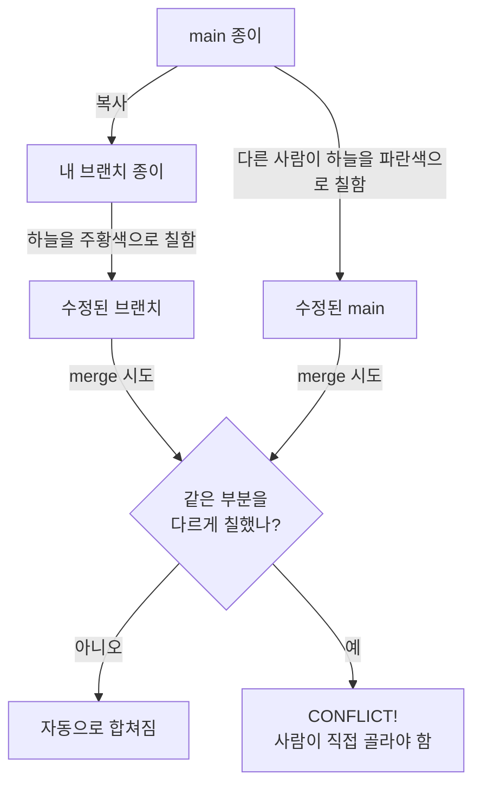

## 들어가며 (Situation)

부트캠프 1주차에는 컴퓨터한테 일을 시키는 두 가지 방법인 **CLI(Command Line Interface)**와 **GUI(Graphical User Interface)**의 차이를 배웠다. 여기까지는 "아, 말로 시키느냐 그림으로 누르느냐 차이구나" 하고 그럭저럭 따라갈 수 있었다.

문제는 그다음이었다. `git branch`부터 시작해서 브랜치를 나누고 합치는 과정을 배우는데, 특히 **merge(병합)와 conflict(충돌)** 부분에서 완전히 길을 잃었다. 개념 설명을 몇 번을 다시 들어도 머릿속에 그림이 그려지지 않았다.

그래서 이번 글은 다르게 접근해보기로 했다. **다섯 살짜리 나에게 설명한다고 생각하고**, 어려운 용어를 다 걷어내고 처음부터 다시 정리해봤다.

## 문제 상황 (Task)

정리하면 이번에 넘어야 했던 문제는 두 가지였다.

1. CLI와 GUI가 "같은 일을 하는 다른 방법"이라는 걸 몸으로 이해하기
2. `git branch`로 나뉜 작업을 다시 합칠 때 생기는 **merge**와 **conflict**를 무섭지 않은 개념으로 만들기

특히 두 번째가 진짜 문제였다. 브랜치를 만들고 옮겨 다니는 것(`checkout`, `switch`)까지는 손으로 몇 번 해보니 익숙해졌는데, 합치는 순간 갑자기 화면에 낯선 기호와 "CONFLICT"라는 글자가 뜨면 뭘 해야 할지 몰라서 그냥 터미널 창을 닫고 싶어졌다.

## 해결 과정 (Action)

### 1. CLI와 GUI, 뭐가 다른 걸까

가장 먼저 "왜 굳이 CLI를 배워야 하지, GUI로 다 되는데"라는 의문부터 풀어야 했다. 다섯 살 아이에게 설명한다면 이렇게 말할 것 같다.

> "GUI는 로봇한테 그림 버튼을 눌러서 심부름을 시키는 거고, CLI는 로봇한테 직접 말로 '이거 해줘, 저거 해줘' 하고 시키는 거야. 말로 시키면 처음엔 어떤 말을 해야 하는지 외워야 해서 어렵지만, 한 번 외우면 로봇한테 여러 심부름을 한 번에 시킬 수도 있고, 똑같은 심부름을 나중에 또 시키기도 훨씬 편해."


이 비유를 코드/도구 관점으로 옮기면 아래처럼 정리된다.

| 항목 | GUI | CLI |
|------|-----|-----|
| 조작 방식 | 마우스로 버튼·아이콘 클릭 | 키보드로 명령어 입력 |
| 배우는 부담 | 눈으로 보고 바로 따라 하기 쉬움 | 명령어와 옵션을 외워야 함 |
| 반복 작업 | 매번 같은 클릭을 반복해야 함 | 명령어를 저장해두면 재사용·자동화 가능 |
| 정밀한 제어 | 도구가 제공하는 기능 범위 안에서만 가능 | 옵션 조합으로 세밀하게 제어 가능 |
| 대표 예시 | GitHub Desktop, Sourcetree | `git`, 터미널 명령어 |

즉 GUI는 "빨리 익숙해지는 대신 도구가 정해준 것만" 할 수 있고, CLI는 "배우는 데 시간이 걸리는 대신 내가 시키는 대로" 할 수 있다는 차이였다. 이 표를 보고 나서야 "둘 중 뭐가 더 좋다"가 아니라 "언제 뭘 쓸지가 다른 것"이라는 게 이해됐다.

### 2. git branch를 다섯 살 언어로 다시 그려보기

branch가 안 와닿았던 이유는 "브랜치 = 나뭇가지"라는 설명을 들어도 실제로 파일이 어떻게 되는 건지 그림이 안 그려졌기 때문이다. 그래서 그림 그리기 비유로 바꿔봤다.

> "브랜치는 원본 그림 위에 바로 낙서하는 게 아니라, **원본 그림을 복사한 새 종이**에 낙서하는 거야. 원본(main)은 그대로 안전하게 남아있고, 새 종이(브랜치)에서 마음껏 그리다가, 마음에 들면 나중에 원본이랑 합치는 거지."


실제로 이 감각을 손으로 확인해본 명령어는 이거였다.

```bash
git branch feature-test     # 원본을 복사한 새 종이 만들기
git checkout feature-test   # 그 새 종이로 옮겨가기
# (여기서 마음껏 수정)
git checkout main           # 다시 원본 종이로 돌아오기
```

| 명령어 | 다섯 살 언어로 |
|--------|----------------|
| `git branch <이름>` | 지금 그림을 복사한 새 종이를 만든다 |
| `git checkout <이름>` / `git switch <이름>` | 어느 종이 위에서 그릴지 고른다 |
| `git merge <이름>` | 다른 종이에 그린 걸 지금 종이에 옮겨 붙인다 |

### 3. merge와 conflict — 가장 헷갈렸던 부분

merge까지는 "종이를 합친다"는 비유로 이해가 됐는데, conflict는 여전히 무서웠다. 여기서 도움이 된 비유는 이거였다.

> "두 친구가 각자 종이를 하나씩 받아서 같은 그림을 그렸어. 그런데 두 명 다 **하늘에 다른 색**을 칠했어. 이제 두 그림을 한 장으로 합치려는데, 로봇은 하늘을 파란색으로 해야 할지 주황색으로 해야 할지 모르겠는 거야. 그래서 로봇이 '나는 못 정하겠으니 너희 둘이 정해줘'라고 말하는 게 바로 conflict야."

같은 부분을 서로 다르게 고쳤을 때만 문제가 생기고, 서로 다른 부분을 고쳤다면 로봇(Git)이 알아서 잘 합쳐준다는 것도 이 비유 덕분에 명확해졌다.




### 4. 시행착오

처음에는 비유 없이 `git merge`, `CONFLICT`, `<<<<<<< HEAD` 같은 표시를 그냥 통째로 외우려고 했다. 결과는 실패였다. 화면에 저 기호들이 뜨는 순간 이게 "지금 내 종이 내용"과 "합치려던 종이 내용"의 경계선이라는 걸 매번 다시 찾아봐야 했다. 그림 비유로 먼저 "왜 이런 상황이 생기는지"를 이해하고 나서야, 그 기호들이 "여기서부터 여기까지가 내 그림, 여기서부터가 상대방 그림"이라는 표시라는 게 자연스럽게 연결됐다.

## 결과 (Result)

아직 conflict를 처음부터 끝까지 능숙하게 해결하는 단계는 아니고, **이제 막 감을 잡기 시작한 단계**다. 다만 확실히 달라진 게 있다.

- Before: "CONFLICT"라는 글자만 봐도 뭘 어떻게 해야 할지 몰라 터미널을 닫고 싶었음
- After: "아, 같은 부분을 서로 다르게 고쳐서 로봇이 못 정한 거구나"까지는 바로 떠올릴 수 있게 됨

수치로 표현하긴 아직 이르지만, 브랜치를 만들고(`branch`) 옮겨 다니는(`checkout`/`switch`) 명령어는 막힘없이 손이 나가는 수준까지는 왔고, merge/conflict는 비유를 떠올리며 천천히 따라갈 수 있는 수준까지 왔다.

## 더 학습하면 좋은 개념

- **Git의 내부 객체 모델 (commit, tree, blob)** — 브랜치가 실제로는 "커밋을 가리키는 포인터"에 불과하다는 걸 알면, 왜 브랜치 생성이 그렇게 가벼운 작업인지 이해할 수 있다.
- **rebase vs merge** — 두 브랜치를 합치는 또 다른 방법으로, 커밋 히스토리를 어떻게 남길지에 대한 선택지가 넓어진다.
- **충돌 표시(`<<<<<<<`, `=======`, `>>>>>>>`) 정확히 읽는 법** — conflict가 나는 원리를 이해한 다음 단계로, 실제 파일 안에서 무엇을 지우고 남길지 판단하는 연습이 필요하다.
- **원격 저장소와 협업 워크플로우 (fork, pull request)** — 나 혼자 브랜치를 다루는 것과 여러 사람이 같은 저장소에서 브랜치를 주고받는 것은 또 다른 문제다.
- **쉘(Shell)과 터미널의 동작 원리** — CLI 명령어가 실제로 운영체제와 어떻게 상호작용하는지 알면, CLI/GUI 차이를 더 근본적으로 이해할 수 있다.

## 참고 자료
- [Pro Git Book - Git Branching](https://git-scm.com/book/en/v2/Git-Branching-Branches-in-a-Nutshell)
- [Pro Git Book - Basic Branching and Merging](https://git-scm.com/book/en/v2/Git-Branching-Basic-Branching-and-Merging)
- [Git 공식 문서 - git-merge](https://git-scm.com/docs/git-merge)
