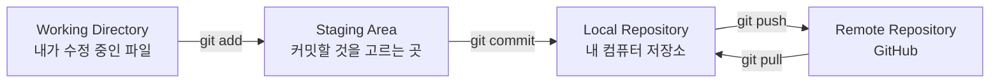
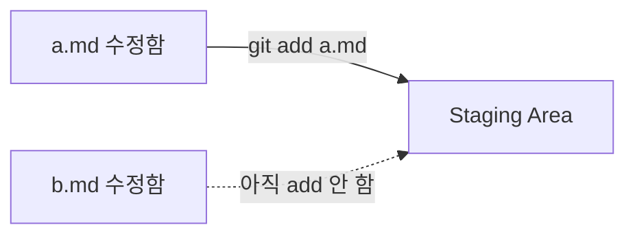
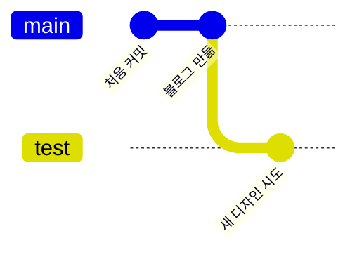
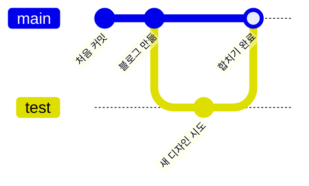
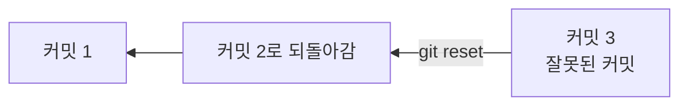
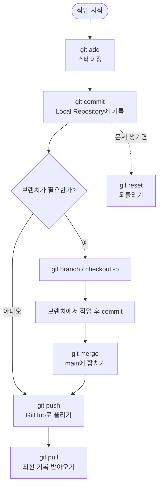

안녕, 나는 이번 주에 Git과 GitHub를 처음 배운 너를 도와줄 선생님이야.
너는 이미 블로그를 만들어서 인터넷에 배포까지 해봤으니, 이제 그 과정에서 썼던
명령어들이 각각 **어디서, 왜** 쓰였는지 하나씩 정리해보자.

## 1. 전체 그림부터 보기

Git으로 파일을 관리하고 GitHub에 올리기까지는 아래처럼 네 개의 공간을
거쳐 이동한다고 생각하면 쉬워.



* 오른쪽으로 갈수록 기록이 더 안전하게 저장된다.
* `push`는 내 기록을 GitHub로 **보내는 것**, `pull`은 GitHub의 기록을
  내 컴퓨터로 **받아오는 것**이라 화살표 방향이 반대야.

## 2. 명령어 요약표

| 명령어 | 언제 쓰나 |
|---|---|
| `git init` | 지금 폴더를 저장소(Repository)로 처음 만들고 싶을 때 |
| `git add` | 수정한 파일 중 이번 커밋에 담을 것을 고를 때 (스테이징) |
| `git commit` | 스테이징한 내용을 Local Repository에 기록으로 남길 때 |
| `git branch` | 지금 브랜치 목록을 보거나, 새 브랜치를 만들고 싶을 때 |
| `git checkout -b <이름>` | 새 브랜치를 만들고 바로 그 브랜치로 이동하고 싶을 때 |
| `git push` | Local Repository의 기록을 GitHub(원격 저장소)로 올릴 때 |
| `git pull` | GitHub에 있는 최신 기록을 내 컴퓨터로 받아오고 싶을 때 |
| `git merge` | 다른 브랜치에서 작업한 내용을 지금 브랜치에 합치고 싶을 때 |
| `git reset` | 잘못된 커밋이나 변경을 취소하고 이전 상태로 되돌리고 싶을 때 |

## 3. 저장소 만들기 — `git init`

```
git init
```

폴더 하나를 Git이 기록을 관리해주는 **저장소(Repository)**로 바꾸는
가장 첫 단계야. 이 명령을 치는 순간부터 그 폴더 안의 변화를 Git이 지켜보기 시작해.

## 4. 스테이징 — `git add`

파일을 고쳤다고 바로 기록(커밋)되는 게 아니야. **이번에 기록할 파일을
고르는 단계**가 따로 있는데, 그게 스테이징이야.



위 그림처럼 두 파일을 고쳤어도 `a.md`만 `add`하면 `b.md`는 이번
커밋에 포함되지 않아. **원하는 것만 골라서 기록할 수 있다**는 게 스테이징의 핵심이야.

## 5. Local Repository와 커밋 — `git commit`

스테이징에 올려둔 내용을 `git commit`으로 확정하면, 그 순간의 상태가
**Local Repository**(내 컴퓨터 안의 저장소)에 하나의 기록으로 남아.

```
git commit -m "커밋 메시지"
```

Local Repository는 지금까지의 커밋들이 시간 순서대로 쌓여 있는
**나만의 저장 지점 목록**이라고 생각하면 돼. 문제가 생겨도 이 지점들 중
하나로 돌아갈 수 있어서 안심하고 작업할 수 있어.

## 6. 브랜치 — `git branch`, `git checkout -b`

브랜치는 원래 작업(main)에 영향을 주지 않고 **따로 실험해볼 수 있는
가지**야.

```
git branch          # 브랜치 목록 보기
git checkout -b test  # test 브랜치를 만들고 바로 이동
```



main은 그대로 두고, test 브랜치에서만 새로운 시도를 해볼 수 있어.

## 7. push와 pull — Local ↔ GitHub

```
git push   # 내 Local Repository → GitHub
git pull   # GitHub → 내 Local Repository
```

너가 블로그를 배포할 때 썼던 것처럼, `push`는 내 컴퓨터의 기록을
GitHub에 있는 저장소로 올려서 인터넷에서 볼 수 있게 해줘. 반대로
다른 컴퓨터나 팀원이 GitHub에 올린 최신 기록을 받아오고 싶을 땐
`pull`을 사용해.

## 8. merge — 브랜치 합치기

```
git merge test
```

test 브랜치에서 했던 작업이 마음에 들면, main 브랜치로 돌아와서
`merge`로 두 브랜치의 기록을 하나로 합칠 수 있어.



## 9. 되돌리기 — `git reset`

커밋을 잘못했거나 마음에 안 들 때는 이전 기록으로 되돌아갈 수 있어.

```
git reset
```



Local Repository에 커밋 지점들이 쌓여 있기 때문에, 문제가 생긴 커밋
이전으로 언제든 되돌아갈 수 있는 거야. 저번 주에 저장소를 통째로
지워서 곤란했던 것 기억하지? `reset`을 알면 처음부터 다시 만들지
않고도 원하는 시점으로 되돌아갈 수 있어.

## 10. 오늘의 정리



이번 주에 배운 아홉 가지 개념(저장소 만들기, 스테이징, Local
Repository, 커밋, 브랜치, push, pull, merge, 되돌리기)이 결국은 위
흐름 하나로 이어진다는 걸 기억해두면 다음 주 내용도 훨씬 쉽게
이해될 거야.
