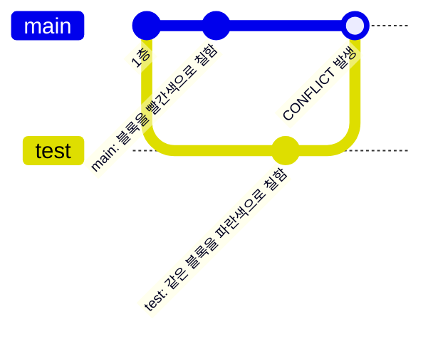
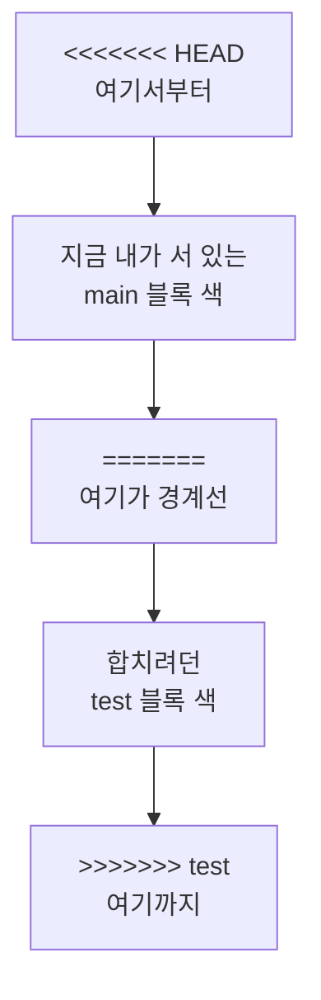
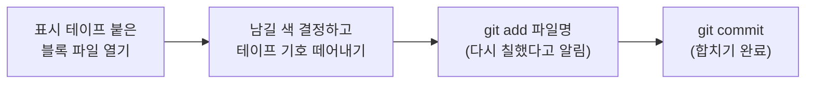
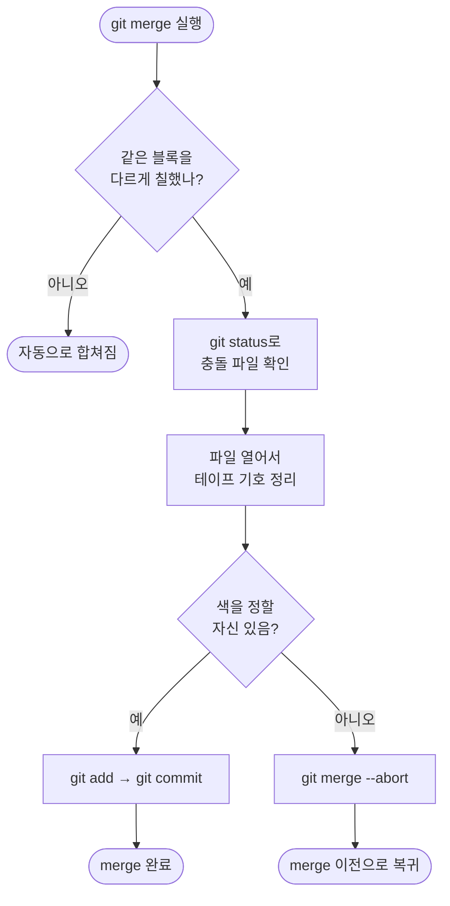

안녕, 지난번엔 `main` 깃발 옆에 `test` 깃발을 꽂아서 따로
쌓아보고, `git merge`로 두 탑을 다시 합치는 이야기를 했었지.
그런데 합치다 보면 언젠가 "CONFLICT"라는 무서운 글자를 마주치게
될 거야. 오늘은 그 **충돌(conflict)**이 뭔지, 왜 생기는지, 어떻게
풀면 되는지만 그림으로 딱 정리해볼게.

## 1. 충돌은 왜 생길까? — 같은 블록을 다른 색으로 칠했을 때

`main` 팀과 `test` 팀이 각자 자기 깃발 옆에서 작업을 했는데,
공교롭게도 **같은 층의 같은 블록**을 서로 다른 색으로 칠했다고
생각해보자. 두 탑을 합치려는 순간, Git은 이 블록을 무슨 색으로
남겨야 할지 스스로 판단할 수 없어. 그래서 사람에게 "네가 골라줘"라고
물어보는 거야. 이게 바로 충돌이야.



* main과 test 둘 다 **같은 블록**을 건드렸기 때문에 합칠 때
  부딪힌 거야.
* 서로 다른 블록을 칠했거나, 같은 블록이라도 다른 부분을 칠했다면
  Git이 알아서 두 색을 자연스럽게 합쳐줘 — 충돌 없이 끝나.

## 2. 충돌이 나면 화면에 뭐가 뜨나

```
git merge test
```

```
Auto-merging index.md
CONFLICT (content): Merge conflict in index.md
Automatic merge failed; fix conflicts and then commit the result.
```

당황하지 않아도 돼. Git이 "이 블록 앞에서 멈췄으니 네가 색을
골라줘"라고 말해주는 것뿐이야. 이 상태에서 `git status`를 치면
어떤 블록(파일)이 충돌 중인지 알려줘.

| 명령어 | 언제 쓰나 |
|---|---|
| `git status` | 지금 어떤 파일이 충돌 상태인지 확인하고 싶을 때 |

## 3. 충돌난 블록엔 표시 테이프가 붙는다

충돌이 난 파일을 열어보면, Git이 그 블록에 **표시 테이프**를
붙여놓은 것처럼 기호를 남겨.

```
<<<<<<< HEAD
main 블록에 칠한 색 (main 브랜치에서 쓴 내용)
=======
test 블록에 칠한 색 (test 브랜치에서 쓴 내용)
>>>>>>> test
```



| 표시 | 의미 |
|---|---|
| `<<<<<<< HEAD` | 여기부터 **지금 내가 서 있는 깃발(main)**의 색 |
| `=======` | 두 깃발의 색을 가르는 경계선 |
| `>>>>>>> test` | 여기까지 **합치려던 깃발(test)**의 색 |

## 4. 충돌 해결하는 순서 — 색을 다시 칠하는 것뿐

방법은 간단해. **둘 중 하나의 색을 고르거나, 두 색을 섞어서 새로
칠한 뒤**, 표시 테이프(`<<<<<<<`, `=======`, `>>>>>>>`)를 전부
떼어내고 저장하면 돼.



| 명령어 | 언제 쓰나 |
|---|---|
| `git add <파일명>` | 색을 다 정하고 "이제 이 블록은 해결됐다"고 Git에게 알릴 때 |
| `git commit` | 충돌 해결까지 끝내고 merge를 최종 완료할 때 |

`git add`를 다시 하는 이유는, 상자(Staging)가 "이번에 창고에
넣을 블록을 고르는 곳"이었던 것처럼, **다시 칠한 최종 색을
고르는 것**과 같은 원리이기 때문이야.

## 5. 자신 없으면 그냥 붓을 내려놔도 된다

색을 고치다가 "역시 다시 생각해봐야겠다" 싶으면, 합치기 자체를
취소하고 두 탑이 갈라졌던 원래 상태로 돌아갈 수도 있어.

```
git merge --abort
```

| 명령어 | 언제 쓰나 |
|---|---|
| `git merge --abort` | 충돌을 풀다가 자신이 없어서 merge 이전 상태로 되돌리고 싶을 때 |

## 6. 오늘의 정리



충돌은 실수가 아니라 **같은 블록을 두 사람이 각자 칠했다는
자연스러운 신호**야. 표시 테이프만 읽을 줄 알면 무서워할 이유가
없어.

## 더 학습하면 좋은 개념

- **3-way merge** — Git이 충돌 여부를 판단할 때 실제로는 main,
  test, 그리고 두 브랜치가 갈라지기 전 공통 조상까지 세 지점을
  비교해. 왜 "같은 줄"만 충돌로 잡히는지 이해하려면 이 비교
  방식을 알아두면 좋아.
- **`git diff`** — 충돌을 고치기 전, 어느 부분이 서로 다르게
  칠해졌는지 미리 눈으로 확인하는 명령이야. 충돌 파일을 열기 전에
  습관처럼 먼저 보면 훨씬 수월해져.
- **머지 도구 (mergetool)** — VS Code 같은 에디터는 충돌 표시
  테이프를 색깔 있는 버튼("Accept Current/Incoming/Both")으로
  보여줘. 텍스트로 직접 지우는 방식이 손에 익으면, 도구를 써서
  더 빠르게 처리하는 법도 익혀두면 좋아.
- **Rebase 후 충돌** — merge 말고 rebase로 브랜치를 합칠 때도
  똑같이 충돌이 날 수 있는데, 해결 절차는 비슷하지만 명령이
  `git rebase --continue`, `git rebase --abort`로 달라. 브랜치
  글에서 다룬 rebase 개념과 이어서 학습하면 좋아.

## 참고 자료

- [Git 공식 문서 - Basic Merge Conflicts](https://git-scm.com/book/en/v2/Git-Branching-Basic-Branching-and-Merging)
- [Git 공식 문서 - git-merge](https://git-scm.com/docs/git-merge)
- [Git 공식 문서 - git-status](https://git-scm.com/docs/git-status)
