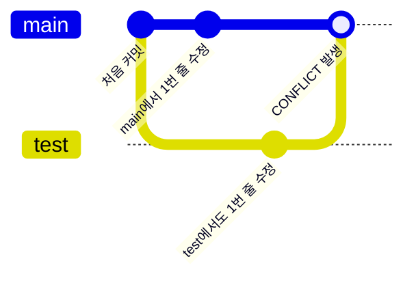
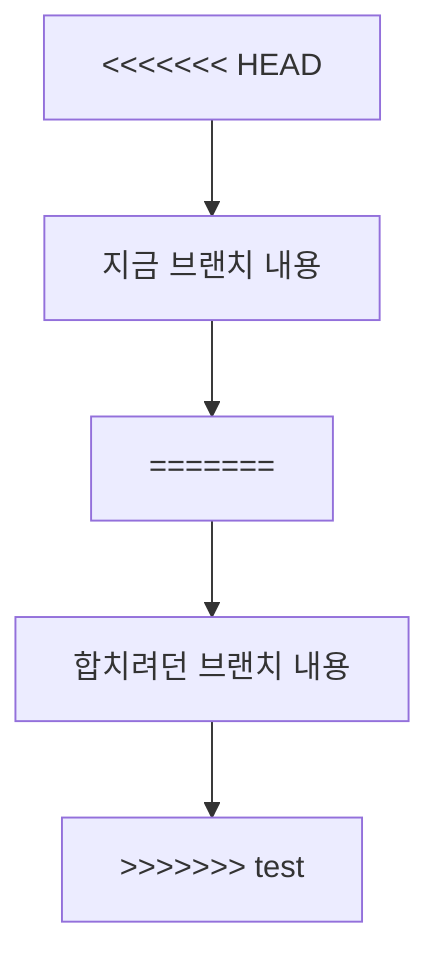
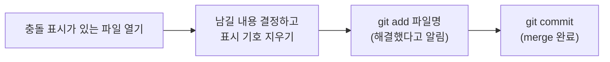
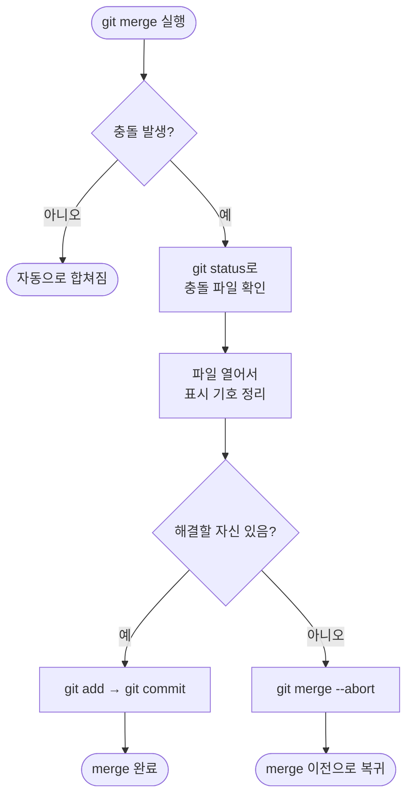

안녕, 지난번엔 브랜치를 합치는 `git merge`를 배웠지.
그런데 merge를 하다 보면 언젠가 "CONFLICT"라는 무서운 글자를
마주치게 될 거야. 오늘은 그 **충돌(conflict)**이 뭔지, 왜 생기는지,
어떻게 풀면 되는지만 딱 정리해볼게.

## 1. 충돌은 왜 생길까?

충돌은 Git이 못하는 게 아니라, **Git도 어떤 걸 골라야 할지 모를 때**
생기는 거야. 서로 다른 두 브랜치가 **같은 파일의 같은 부분**을
다르게 고쳤다면, Git은 둘 중 뭘 남겨야 할지 판단할 수 없어서 사람에게
물어보는 거지.



* main과 test 둘 다 **같은 줄**을 건드렸기 때문에 합칠 때 부딪힌 거야.
* 서로 다른 파일을 고쳤거나, 같은 파일이라도 다른 줄을 고쳤다면
  충돌 없이 자동으로 합쳐져.

## 2. 충돌이 나면 화면에 뭐가 뜨나

```
git merge test
```

```
Auto-merging index.md
CONFLICT (content): Merge conflict in index.md
Automatic merge failed; fix conflicts and then commit the result.
```

당황하지 않아도 돼. Git이 "이 파일에서 막혔으니 네가 골라줘"라고
말해주는 것뿐이야. 이 상태에서 `git status`를 치면 어떤 파일이
충돌 중인지 알려줘.

| 명령어 | 언제 쓰나 |
|---|---|
| `git status` | 지금 어떤 파일이 충돌 상태인지 확인하고 싶을 때 |

## 3. 충돌난 파일 안은 이렇게 생겼다

충돌이 난 파일을 열어보면 Git이 직접 표시를 남겨놔.

```
<<<<<<< HEAD
main 브랜치에서 쓴 내용
=======
test 브랜치에서 쓴 내용
>>>>>>> test
```

이 기호들이 뜻하는 건 이거야.

| 표시 | 의미 |
|---|---|
| `<<<<<<< HEAD` | 여기부터 **지금 브랜치(main)**의 내용 |
| `=======` | 여기가 두 브랜치 내용의 경계선 |
| `>>>>>>> test` | 여기까지 **합치려던 브랜치(test)**의 내용 |



## 4. 충돌 해결하는 순서

방법은 간단해. **둘 중 하나를 고르거나, 둘을 합쳐서 새로 쓴 뒤**,
Git이 남긴 표시(`<<<<<<<`, `=======`, `>>>>>>>`)를 전부 지우고
저장하면 돼.



| 명령어 | 언제 쓰나 |
|---|---|
| `git add <파일명>` | 충돌을 다 고치고 "이제 이 파일은 해결됐다"고 Git에게 알릴 때 |
| `git commit` | 충돌 해결까지 끝내고 merge를 최종 완료할 때 |

`git add`를 다시 하는 이유는, 스테이징이 "이번에 기록할 내용을
고르는 곳"이었던 것처럼, **충돌을 해결한 최종 결과물을 고르는 것**과
같은 원리이기 때문이야.

## 5. 자신 없으면 그냥 멈춰도 된다

충돌을 고치다가 "역시 다시 생각해봐야겠다" 싶으면, merge 자체를
취소하고 원래 상태로 돌아갈 수도 있어.

```
git merge --abort
```

| 명령어 | 언제 쓰나 |
|---|---|
| `git merge --abort` | 충돌을 풀다가 자신이 없어서 merge 이전 상태로 되돌리고 싶을 때 |

## 6. 오늘의 정리



충돌은 실수가 아니라 **같은 부분을 두 사람이 고쳤다는 자연스러운
신호**야. 표시 기호만 읽을 줄 알면 무서워할 이유가 없어.
