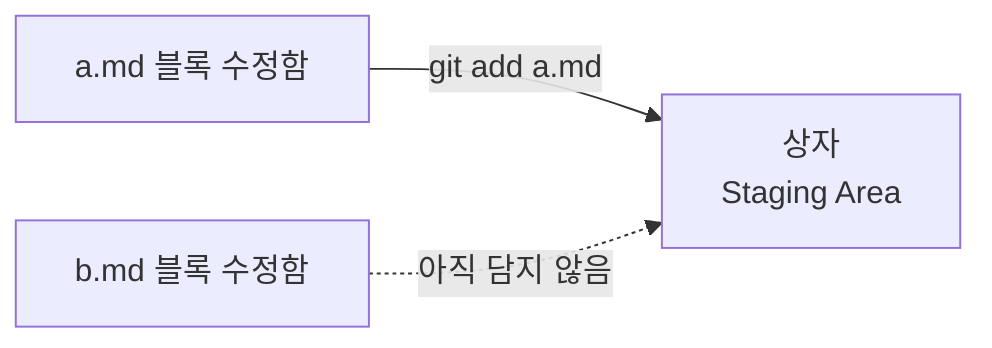
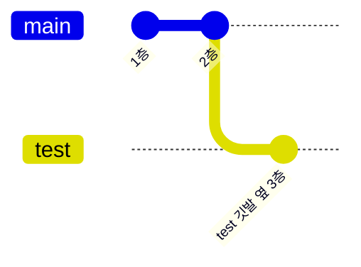
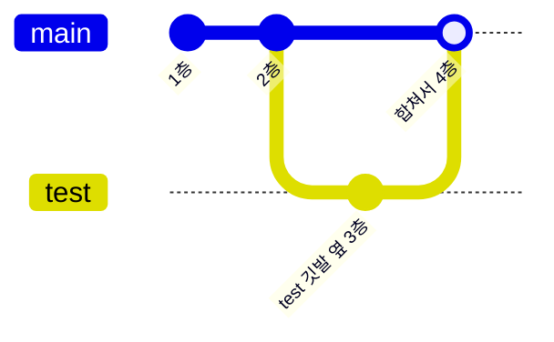
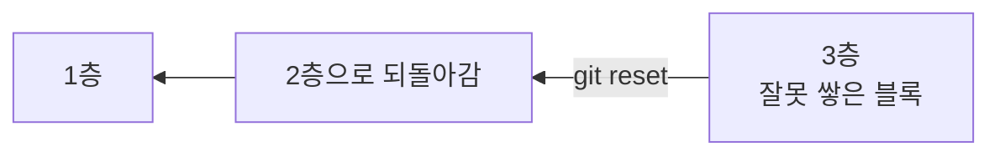
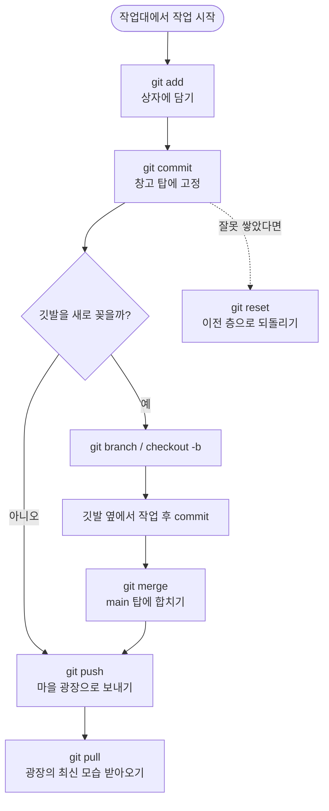

안녕, 나는 이번 주에 Git과 GitHub를 처음 배운 너를 도와줄 선생님이야.
지난번 브랜치 글에서 "블록 탑 + 깃발" 이야기를 했었지? 이번엔 그
세계관을 그대로 가져와서, 이번 주에 배운 명령어 전부를 하나의
그림 안에 넣어볼게. 용어를 따로따로 외우지 말고, **블록이 어느
장소에서 어느 장소로 움직이는지**만 따라가면 돼.

## 1. 오늘의 세계관 — 네 개의 장소

Git 작업은 결국 블록(파일)이 아래 **네 장소**를 옮겨 다니는
이야기야.

| 장소(비유) | 진짜 이름 | 뭐 하는 곳인가 |
|---|---|---|
| 작업대 | Working Directory | 지금 내가 손에 들고 만지작거리는 블록들 (수정 중인 파일) |
| 상자 | Staging Area | 이번에 창고에 넣을 블록만 골라 담는 곳 |
| 내 창고 | Local Repository | 상자를 확정해서 탑으로 쌓아 올리는 내 컴퓨터 안의 공간 |
| 마을 광장 | Remote Repository (GitHub) | 모두가 볼 수 있게 세워둔 공용 탑 |


오른쪽으로 갈수록 블록이 더 단단하게, 더 많은 사람과 함께
고정된다고 생각하면 돼. `push`는 내 창고 탑을 광장에 **보내는
것**, `pull`은 광장 탑의 최신 모습을 내 창고로 **받아오는 것**이라
화살표 방향이 반대야.

## 2. 창고 짓기 — `git init`

```
git init
```

아직 아무 탑도 없는 빈 땅에 **창고를 처음 짓는** 명령이야. 이 순간부터
Git이 그 창고 안의 블록 변화를 하나하나 지켜보기 시작해.

## 3. 상자에 담기 — `git add`

블록을 손봤다고 바로 탑에 쌓이는 게 아니야. **이번에 쌓을 블록만
상자에 담는 단계**가 따로 있어.



두 블록을 손봤어도 `a.md`만 상자에 담으면, `b.md`는 이번 탑
쌓기에서 빠져. **원하는 블록만 골라 담을 수 있다**는 게 상자의
핵심이야.

## 4. 탑에 고정하기 — `git commit`

```
git commit -m "커밋 메시지"
```

상자에 담아둔 블록을 `git commit`으로 확정하면, 그 블록이 **내
창고 탑**의 한 층으로 단단히 고정돼. 창고 탑은 지금까지 쌓아온
층들이 순서대로 남아있는 **나만의 저장 기록**이라서, 문제가 생겨도
예전 층으로 돌아갈 수 있어 안심하고 실험할 수 있어.

## 5. 깃발 꽂기 — `git branch`, `git checkout -b`

원래 탑(main 깃발)은 그대로 두고, 옆에 깃발을 하나 더 꽂아
그 자리에서만 새로운 블록을 쌓아보는 것 — 이게 브랜치야. 자세한
이야기는 지난 브랜치 글에서 다뤘으니, 오늘은 명령어만 짚고 갈게.

```
git branch          # 지금 꽂혀 있는 깃발 목록 보기
git checkout -b test  # test 깃발을 새로 꽂고 그 자리로 이동
```



`main` 깃발은 2층 자리에 그대로 있고, `test` 깃발만 3층으로
옮겨갔어. 원래 탑은 전혀 흔들리지 않아.

## 6. 창고와 광장 사이 옮기기 — `git push`, `git pull`

```
git push   # 내 창고 탑 → 마을 광장
git pull   # 마을 광장 → 내 창고 탑
```

너가 블로그를 배포할 때 썼던 것처럼, `push`는 내 창고에 쌓은
탑 모습을 광장에 반영해서 다른 사람도 볼 수 있게 해줘. 반대로
다른 사람이 광장 탑에 새로 쌓아 올린 층을, 내 창고 탑에도
똑같이 반영하고 싶을 땐 `pull`을 써.

## 7. 두 갈래 탑 합치기 — `git merge`

```
git merge test
```

`test` 깃발 옆에서 쌓아본 층이 마음에 들면, `main` 깃발이 있는
자리로 돌아와서 두 갈래를 하나로 합칠 수 있어.



두 탑이 **같은 층의 같은 자리**를 서로 다르게 쌓았을 때만
"CONFLICT(충돌)"이 나는데, 그 이야기는 다음 글에서 자세히 다뤘어.

## 8. 잘못 쌓은 블록 빼기 — `git reset`

```
git reset
```



창고 탑에 층이 순서대로 쌓여 있기 때문에, 문제가 생긴 층 이전
상태로 언제든 되돌아갈 수 있어. 저번에 창고를 통째로 지워서
곤란했던 것 기억하지? `reset`을 알면 처음부터 다시 짓지 않고도
원하는 층으로 돌아갈 수 있어.

## 9. 오늘의 정리



이번 주에 배운 아홉 가지(창고 짓기, 상자에 담기, 탑에 고정하기,
깃발 꽂기, 광장으로 보내기/받아오기, 두 탑 합치기, 블록 빼기)가
결국은 **작업대 → 상자 → 내 창고 → 마을 광장**이라는 한 줄기
흐름 위에 있다는 걸 기억해두면 다음 내용도 훨씬 쉽게 이해될 거야.

## 더 학습하면 좋은 개념

- **HEAD** — 지금 내가 어느 깃발 옆에 서 있는지 가리키는 표시야.
  `git checkout`으로 깃발을 옮기면 이 HEAD가 움직이는 것뿐이라는
  걸 알면, 브랜치 이동이 왜 가벼운지 이해가 쉬워져.
- **`.gitignore`** — 애초에 상자에 담을 필요 없는 블록(로그 파일,
  설정 파일 등)을 Git이 아예 쳐다보지 않게 정하는 목록이야. 매번
  실수로 필요 없는 파일을 커밋하지 않으려면 익혀두면 좋아.
- **`git log`** — 지금까지 쌓아 올린 창고 탑의 층을 순서대로
  구경하는 명령이야. `reset`으로 어느 층까지 되돌릴지 정할 때
  꼭 먼저 확인하게 되는 명령이라 함께 알아두면 좋아.
- **원격 브랜치 (remote-tracking branch)** — 지금까지는 내 창고
  안의 깃발 이야기였다면, `origin/main`처럼 광장 쪽 탑을 가리키는
  깃발도 따로 있어. `push`, `pull`이 실제로 어떤 깃발을 움직이는지
  알면 협업할 때 헷갈리는 상황이 줄어.

## 참고 자료

- [Git 공식 문서 - Git Basics](https://git-scm.com/book/en/v2/Getting-Started-Git-Basics)
- [Git 공식 문서 - git-add](https://git-scm.com/docs/git-add)
- [Git 공식 문서 - git-commit](https://git-scm.com/docs/git-commit)
- [Git 공식 문서 - git-push](https://git-scm.com/docs/git-push)
- [Git 공식 문서 - git-pull](https://git-scm.com/docs/git-pull)
- [Git 공식 문서 - git-reset](https://git-scm.com/docs/git-reset)
