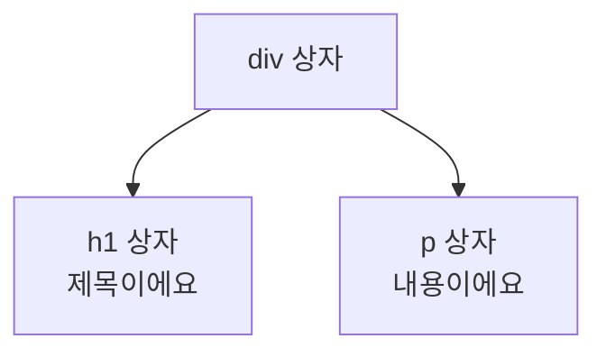
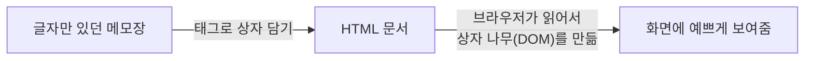

안녕! 오늘은 웹사이트를 만들 때 제일 먼저 배우는 **HTML**을, 다섯 살
조카한테 설명한다고 생각하고 최대한 쉬운 그림으로 풀어볼게. 어려운
용어는 다 빼고 "상자놀이"로 생각하면 돼.

## 1. HTML이 뭐야? — 상자 쌓기 놀이

컴퓨터한테 "여기는 제목이야", "여기는 그림이야", "여기는 버튼이야"라고
알려주려면, 그냥 글자만 써놓으면 안 돼. 컴퓨터는 글자 뭉치를 보고
어디가 제목이고 어디가 그림인지 스스로 구분하지 못하거든. 그래서
우리는 내용물 하나하나를 **상자에 담고, 상자 겉에 이름표를 붙여서**
컴퓨터한테 알려줘. 그 이름표 붙은 상자가 바로 **태그(tag)**고, 태그로
쓴 문서가 **HTML**이야.

| 상황 | 그냥 메모장에 글자만 씀 | HTML로 상자에 담아서 씀 |
|---|---|---|
| 컴퓨터가 아는 것 | "글자가 나열되어 있다"는 것만 앎 | "이건 제목", "이건 그림", "이건 버튼"까지 구분함 |
| 브라우저가 보여주는 방식 | 줄바꿈도 못 알아채고 다 붙여서 보여줌 | 제목은 크게, 문단은 문단답게, 그림은 그림답게 보여줌 |

## 2. 태그 하나 뜯어보기 — 여는 뚜껑, 내용물, 닫는 뚜껑

가장 작은 상자 하나를 열어보자. `<p>안녕, 나는 문단이야!</p>` 라고
쓰면, 이건 세 조각으로 이루어져 있어.


* **여는 뚜껑** `<p>` — "지금부터 문단 상자를 열게요"
* **내용물** — 상자 안에 실제로 들어있는 글자나 그림
* **닫는 뚜껑** `</p>` — "여기까지가 문단 상자예요" (슬래시가 붙으면
  "닫는다"는 뜻)

열 때 쓴 이름표와 닫을 때 쓴 이름표는 **반드시 짝이 맞아야** 해.
`<p>`로 열었으면 `</div>`가 아니라 꼭 `</p>`로 닫아야 컴퓨터가
헷갈리지 않아.

## 3. 상자 속 상자 — 태그를 겹쳐 쓰기 (Nesting)

상자 안에 또 다른 상자를 넣을 수도 있어. 큰 상자 안에 작은 상자
두 개를 넣는다고 생각해보자.


```html
<div>
  <h1>제목이에요</h1>
  <p>내용이에요</p>
</div>
```

여기서 살짝 심화 내용 하나. 상자를 닫는 순서는 아무렇게나 하면 안
되고, **제일 나중에 연 상자를 제일 먼저 닫아야** 해. 러시아 인형
마트료시카처럼, 안쪽 상자부터 뚜껑을 덮고 그다음 바깥쪽 상자를
덮는 거지. 브라우저는 이 순서를 보고 "어떤 상자가 어떤 상자 안에
들어있는지" 나무 모양(트리 구조)으로 이해해. 이 나무 구조를
**DOM(Document Object Model)**이라고 부르는데, 자세한 건 아래
"더 학습하면 좋은 개념"에서 짚을게.



## 4. 자주 쓰는 상자들 모음

모든 상자를 다 외울 필요는 없어. 처음엔 자주 쓰는 몇 가지만 알아도
충분해.

| 태그 | 다섯 살 버전 설명 | 실제 역할 |
|---|---|---|
| `<h1>` ~ `<h6>` | 제일 큰 목소리로 말하는 제목 상자 (숫자가 작을수록 더 큼) | 제목/소제목 |
| `<p>` | 이야기를 문단으로 나눠주는 상자 | 문단 |
| `` | 그림을 붙여넣는 상자 (닫는 뚜껑이 따로 없어요) | 이미지 |
| `<a>` | 손가락으로 누르면 다른 곳으로 데려다주는 상자 | 링크 |
| `<ul>` / `<li>` | 장바구니 목록처럼 항목을 나열하는 상자 | 목록 |
| `<div>` | 특별한 의미 없이 그냥 여러 상자를 한 덩어리로 묶는 상자 | 구역 묶음 |
| `<button>` | 눌러달라고 만든 상자 | 버튼 |

## 5. 상자에 붙이는 스티커 — 속성(Attribute)

어떤 상자는 겉면에 **스티커**를 붙여서 추가 정보를 줄 수 있어.
예를 들어 그림 상자 ``는 "어떤 그림을 보여줄지", "그림이 안
보이면 뭐라고 말해줄지"를 스티커로 알려줘야 해.


```html

```

* `src="고양이.jpg"` — "이 그림 파일을 보여줘"라는 스티커
* `alt="고양이 사진"` — 그림이 안 보이거나, 시각장애인이 화면
  읽기 프로그램을 쓸 때 "여기 고양이 사진이 있어요"라고 대신
  읽어주는 스티커. 그래서 `alt`는 꾸미기용이 아니라 **꼭 채워야
  하는** 스티커야.

## 6. 우리 집 전체 구조 — html, head, body

지금까지 본 상자들을 다 모으면, HTML 문서 전체는 집 한 채와
비슷해.


```html
<html>
  <head>
    <title>내 홈페이지</title>
  </head>
  <body>
    <h1>안녕하세요</h1>
    <p>제 블로그에 오신 걸 환영해요</p>
  </body>
</html>
```

* `<html>` — 집 전체 (제일 큰 상자)
* `<head>` — 손님(사용자)한테는 안 보이는 방. 제목, 설정 같은
  "설계도"만 넣어두는 곳
* `<body>` — 손님이 실제로 구경하는 방. 화면에 진짜로 보이는
  모든 내용이 여기 들어가

## 7. 오늘의 정리



결국 HTML은 "내용물을 상자에 담고, 상자에 이름표와 스티커를 붙여서,
컴퓨터한테 이게 뭔지 알려주는 방법"이야. 상자를 어떻게 쌓든 자유지만,
연 순서의 반대로 닫아야 한다는 규칙만 기억하면 나머지는 자주 쓰다
보면 자연스럽게 손에 익어.

## 더 학습하면 좋은 개념

- **CSS** — 상자 겉면을 색칠하고 꾸미는 방법이야. HTML이 "무엇이
  있는지"를 정한다면, CSS는 "어떻게 보이는지"를 정해. 둘을 나눠서
  생각하면 나중에 디자인을 바꿀 때 훨씬 편해져.
- **시맨틱 태그(semantic tag)** — `<div>` 대신 `<header>`,
  `<nav>`, `<main>`, `<footer>`처럼 **의미가 담긴 이름표**를 붙이는
  방법이야. 상자 이름이 뜻을 가지면 검색엔진이나 화면 읽기
  프로그램이 문서 구조를 더 잘 이해할 수 있어.
- **DOM(Document Object Model)** — 브라우저가 HTML 태그들을
  읽어서 만드는 "상자 나무" 구조야. 자바스크립트로 화면을 바꾸는
  모든 동작이 결국 이 나무를 조작하는 것이라서, HTML 다음 단계로
  꼭 짚고 넘어가면 좋아.
- **웹 접근성(Web Accessibility)** — `alt` 속성처럼, 그림을 못
  보거나 마우스를 못 쓰는 사람도 똑같이 정보를 얻을 수 있게 만드는
  원칙이야. 처음부터 습관을 들이면 나중에 다시 고치는 수고를 줄일
  수 있어.
- **JavaScript** — 상자를 가만히 두지 않고 **움직이게(동작하게)**
  만드는 언어야. 버튼을 눌렀을 때 상자가 나타나거나 사라지는 것 같은
  동작은 HTML/CSS만으로는 안 되고 JavaScript가 필요해.
