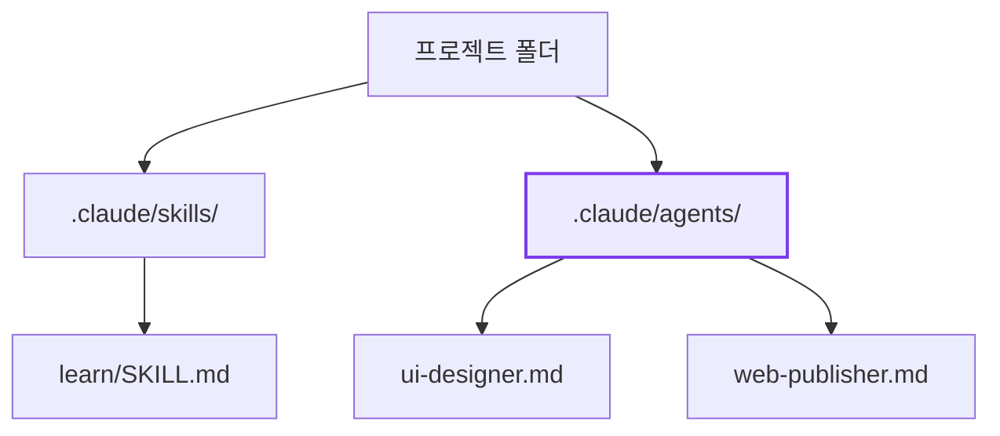
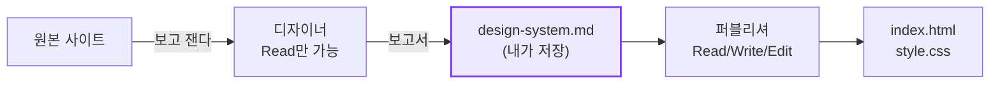
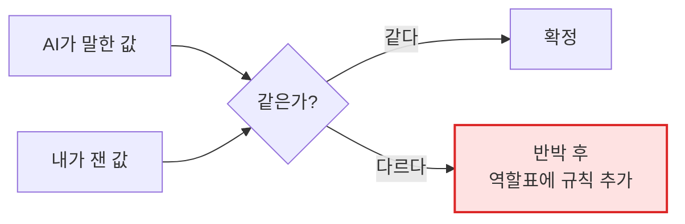
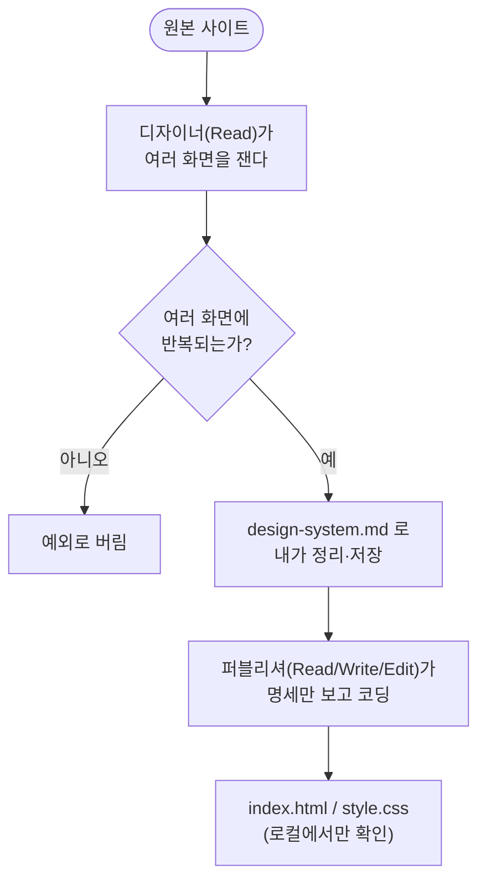

안녕! 오늘은 HTML/CSS를 손으로 안 쓰고, 대신 **AI 직원 두 명을 뽑아서**
마음에 드는 사이트를 따라 만들어보는 이야기야. 손 대신 **역할표 한 장과
출입증 하나**로 일을 시킨다고 생각하면 돼.

## 1. 서브에이전트 — 역할표 한 장

지금까지는 규칙을 적는 자리가 두 곳 있었어. `CLAUDE.md`에는 "이
프로젝트는 이렇게 생겼다"는 **사실**을 적고, 스킬에는 "이 일은 이
순서로 한다"는 **절차**를 적었지.

그런데 "이 사람은 화면은 봐도 되지만 코드는 못 고친다"는 건 사실도
절차도 아니야. **역할**이지. 이 역할을 적는 자리가 **서브에이전트**야.
`.claude/agents/이름.md` 파일 하나가 곧 직원 한 명의 역할표가 돼.




| | 스킬 | 서브에이전트 |
|---|---|---|
| 두는 곳 | 폴더 안에 `SKILL.md` | 파일 하나 그 자체 |
| 부르는 법 | `/이름` | "○○ 서브에이전트를 써서…"라고 말로 부름 |
| 이름표 | 폴더 이름이 곧 이름 | 머리말에 `name:`을 **꼭** 적어야 함 |

여기서 스킬이랑 정반대인 지점이 하나 있어. `name:`을 빼먹고 만든
직원은 오류가 나는 게 아니라 **명단에 아예 안 뜬다**는 거야. 불러도
"그런 직원 없다"고 하면서 지금 뽑을 수 있는 명단을 전부 보여줘. 덕분에
내 직원이 명단에 없다는 걸 그 자리에서 알 수 있어.


## 2. 출입증(`tools:`) — 부탁이 아니라 진짜 잠금

역할표 본문에 "파일 고치지 마"라고 적어두는 건 **부탁**이야. 글이라서
지켜질 수도, 안 지켜질 수도 있어.

진짜로 못 하게 막는 건 따로 있어. 머리말에 `tools:` 한 줄을 넣으면
그 목록 밖의 일은 **아예 할 수가 없어**져. 사람으로 치면 직함만 주는
게 아니라 **어느 방에 들어갈 수 있는 출입증**을 주는 거랑 같아.
출입증이 없으면 사람은 가진 사람한테 부탁이라도 하지만, AI 직원은
부탁할 상대가 없어서 그 일 자체를 못 해.

이번에 뽑을 직원 둘은 일부러 출입증을 다르게 줘.

| 직원 | `tools:` | 못 하는 일 |
|---|---|---|
| UI/UX 디자이너 | `Read` | HTML·CSS 수정 |
| 웹 퍼블리셔 | `Read, Write, Edit` | 원본 사이트 구경 |




퍼블리셔한테 디자인 권한을 안 주는 이유가 여기 있어. 원본을 다시 볼 수
없으니까, `design-system.md`에 없는 색은 어디서도 못 가져와. **내가
넘긴 명세가 곧 그 직원의 세계 전부**가 되는 거야.

한 가지 무서운 점은, 출입증 이름을 **하나만** 틀리면 아무 경고도 없이
그 도구만 조용히 사라진다는 거야. (이름을 전부 틀리면 오히려 친절하게
"이 이름들은 모른다"고 알려줘.) 그래서 규칙이 하나 생겨. **직원을 만든
직후에, 막아둔 일을 일부러 한 번 시켜본다.** 이게 출입증이 진짜로
걸렸는지 확인하는 유일한 방법이야.

## 3. 느낌 대신 자로 재기 — 디자인 시스템과 토큰

"이런 느낌으로 만들어줘"라고 하면 뭔가 나오긴 하는데, 원본이랑 나란히
놓으면 달라. "느낌"에는 잴 수 있는 게 하나도 없거든. 반대로 화면은
결국 전부 **숫자**로 되어 있어.

| 눈에 보이는 것 | 실제로 적힌 값 |
|---|---|
| 산뜻한 주황색 | `#ff6600` |
| 넉넉한 여백 | `padding: 16px` |
| 부드러운 모서리 | `border-radius: 6px` |

이렇게 한 서비스가 화면 전체에서 반복해서 쓰는 규칙 묶음을 **디자인
시스템**, 그 안의 낱개 값(`#ff6600` 하나, `16px` 하나) 하나하나를
**디자인 토큰**이라고 불러. 그런데 사이트를 자동으로 재면 값이 지저분한
채로 나와. 그대로 못 쓰고 정리가 필요해.

| 재서 나온 값 | 정리 방법 |
|---|---|
| `rgb(255, 72, 0)` | hex로 바꾼다 → `#ff4800` |
| `rgba(0,0,0,0)` | 완전 투명 — 색이 아니니 버린다 |
| `9999px` | 숫자가 아니라 "알약 모양"으로 적는다 |

그리고 함정이 하나 있어. **가장 많이 쓰인 색이 강조색은 아니야.**
보통은 본문 글자색이 제일 많이 나와. 진짜 강조색은 사진에서 눈에 띄는
색을 따로 확인해야 해.

## 4. 한 화면만 재면 안 되는 이유

같은 사이트라도 화면 하나만 재면 **그 화면만의 예외**와 **사이트
전체의 규칙**을 구분할 수 없어. 그래서 항상 화면 서너 개를 같이 재.
실제로 있었던 예야.

| 값 | 화면 1개만 봤을 때 | 화면 4개를 봤을 때 |
|---|---|---|
| `#474747` | 26번 쓰임 → 시스템으로 착각 | 4개 중 1개 화면에만 있음 → 예외였다 |
| `#a0a0a0` | 1번뿐 → 예외로 버림 | 4개 중 3개 화면에 있음 → 진짜 시스템이었다 |


**세어야 하는 건 횟수가 아니라 화면 수**라는 거지. 그리고 값의 출처에는
순서가 있어.

1. 회사가 직접 코드에 적어둔 값 (있으면 이게 정답)
2. 여러 화면에 반복되는 값
3. 한 화면에만 있는 값 → 시스템에 넣지 않음

마지막 확정은 사람 몫이야. 크롬 개발자 도구에서 요소를 우클릭 →
검사 → **계산됨(Computed)** 탭을 열어서 직접 잰 값과 AI가 뽑은 값을
표로 나란히 놓고 비교해. 다르면 그냥 고치고 끝내는 게 아니라, **왜
틀렸는지를 디자이너 역할표에 규칙으로 한 줄 더 적어 넣어야** 다음
사이트를 잴 때 같은 실수를 안 해.



## 5. 클론의 안전선

이건 어디까지나 **학습용 연습**이야. 그대로 두는 것과 반드시 바꾸는
것을 나눠야 해.

| 그대로 둔다 | 반드시 바꾼다 |
|---|---|
| 색·글자 크기·간격·모서리·배치 | 로고·사진·실제 상품명·가격·서비스명 |


옷 치수를 재서 적어두는 거랑 비슷해. 치수(간격·크기)는 참고해도 되지만,
브랜드(로고·이름·사진)까지 그대로 쓰면 그건 베끼는 거니까. 그리고
결과물은 **인터넷에 올리지 않고 내 컴퓨터에서만** 열어 봐. 파일 맨
위에는 이렇게 표시를 남겨.

```
<!-- 학습용 클론 — 배포하지 않음 -->
```

## 오늘의 정리



결국 오늘 한 일은 하나야. **역할과 출입증으로 두 직원을 갈라놓고,
AI가 뽑은 숫자를 내가 직접 잰 숫자로 반박하거나 확정하는 것.** 화면이
아니라 이 판정 과정 자체가 오늘의 결과물이야.

## 더 학습하면 좋은 개념

- **원자 디자인(Atomic Design)** — 토큰 → 컴포넌트 → 패턴 순으로
  작은 값을 쌓아 큰 화면을 만드는 방식이야. 오늘 만든 한 장짜리
  문서가 이 구조의 맨 아래 칸이라는 걸 알면, 나중에 진짜 디자인
  시스템을 읽을 때 헤매지 않아.
- **CSS 변수(Custom Property)** — 회사가 코드에 미리 적어둔
  `--spacing-1` 같은 값들이야. 재지 않고 읽기만 해도 되니, 이게
  있는 사이트인지부터 확인하면 시간을 아낄 수 있어.
- **Playwright** — 오늘 값을 재는 도구가 실제로 브라우저를 자동으로
  열고 조작하는 데 쓰는 라이브러리야. "어떻게 화면을 자동으로
  재는지"가 궁금해지면 다음 단계로 배우면 좋아.
- **훅(Hook)과 MCP** — 서브에이전트 다음에 오는 확장 자리야. 훅은
  "정해진 때 자동으로 실행", MCP는 "바깥 서비스의 도구를 끌어오는
  연결"이야. 이름만 알아두고 지금은 안 써도 돼.
