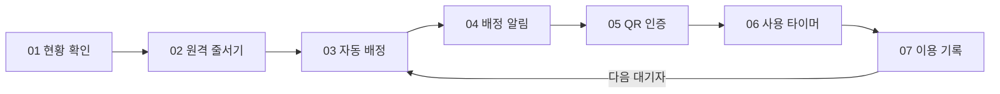
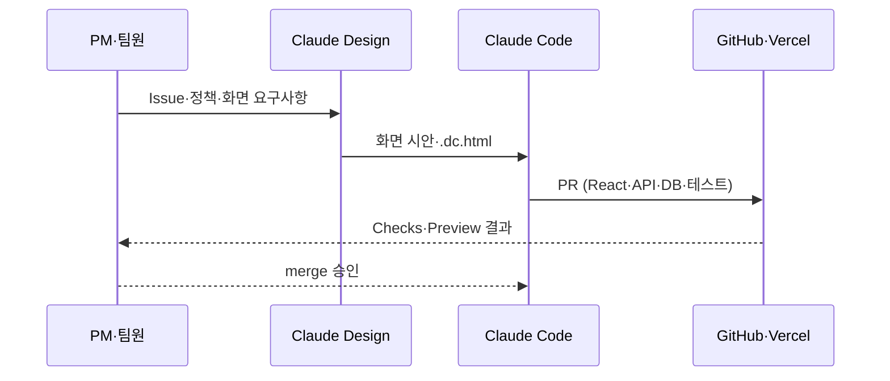

## 들어가며 (Situation)

2BA 팀(정주희, 서수영, 이서연, 조성원)은 2026.09.11 ~ 09.21, 열흘간 **Washed**라는 웹 서비스를 만들었습니다. 기숙사 공용 세탁실에서 반복되던 불편을 해결하는 프로젝트였고, 저는 그중 **프론트엔드, 계정/설정, 관리자 UI**(로그인/로그아웃 흐름, 사용 타이머, 알림 설정, 프로필·비밀번호 검증, 관리자 전체 점검과 상태 정합성)를 맡았습니다.

기숙사에 실제로 살았던 팀원의 경험을 바탕으로 문제를 정의했습니다.

- 빈 기기가 있는지 확인하려면 직접 세탁실까지 내려가야 한다
- 기기가 다 사용 중이면 언제 다시 내려가야 할지 알 수 없다
- 여러 명이 기다릴 때 순서 기준이 모호하다
- 차례·종료·수거를 계속 직접 확인해야 하는 번거로움이 있다

## 문제 상황 (Task)

이 네 가지를 한 문장으로 정리하면 이렇습니다.

> 실시간 현황 확인 → 원격 줄서기 → FIFO 자동 배정 → QR 인증 → 사용 타이머 → Push·앱 알림 → 이용 기록

핵심 제약은 두 가지였습니다.

1. **"확인"을 사람이 반복하지 않아야 한다** — 배정·만료·권한·시간 정책을 클라이언트가 아니라 서버가 판정해야, 여러 사용자가 동시에 접근해도 상태가 어긋나지 않습니다.
2. **열흘이라는 기간 안에 MVP 12개를 전부 구현해야 한다** — 우선순위를 매기고 위에서부터 끝내는 방식이 필요했습니다.

## 해결 과정 (Action)

### 디자인: Figma 대신 Claude Design

시안 제작 도구부터 검토했습니다.

| 항목 | Figma | Claude Design |
|------|-------|----------------|
| 시안 → 코드 전환 | 별도 변환 단계 필요 | 산출물(`.dc.html`)을 거의 그대로 React + Tailwind로 이전 |
| 협업 기준 | 디자이너가 시안을 들고 설명 | `docs/07-screens.md` 문서를 팀 전체가 기준으로 참고 |
| 기간 대비 속도 | 시안 제작에 별도 시간 소요 | 2주 안에 시안과 구현을 동시에 진행 |

Claude Design으로 로그인·홈·기록·설정·관리자 화면의 시안을 만들고 코드로 옮겼습니다. 다만 디자인 원본과 실제 React 토큰이 한동안 두 곳에 나뉘어 있었는데, `globals.css`를 단일 원본으로 잡고 나서야 정합성이 맞았습니다. 색은 Primitive → Semantic → 서비스 전용 색(세탁기: Light Blue, 건조기: Red Orange) 순으로 쌓았고, 원티드랩의 오픈소스 디자인 시스템 Montage(MIT License) 토큰을 기반으로 서비스 전용 액센트만 추가했습니다.

반응형도 이 단계에서 함께 처리했습니다(Issue #69). 390px 고정이던 화면을 Tailwind 브레이크포인트로 확장해, 레이아웃 구조를 바꾸지 않고 모바일·태블릿·데스크톱에서 같은 컴포넌트를 재사용하도록 만들었습니다.

### 서버가 상태를 이어받는 7단계 흐름

사용자 여정을 하나의 흐름으로 연결했습니다. 어느 단계에서 끊겨도(앱을 꺼도) 서버가 다음 상태를 이어받도록 설계한 것이 핵심입니다.

- **판정**: 배정·만료·권한·시간 정책은 전부 서버와 DB에서 판정합니다. 클라이언트는 판단하지 않습니다.
- **알림**: Web Push와 앱 알림함을 함께 두어 브라우저 알림 권한이 꺼져 있어도 차례를 놓치지 않게 이중화했습니다.
- **기록**: 사용이 끝나면 이용 기록·신고·경고로 이어지고, 다음 대기자에게 자동 배정됩니다.

예외 흐름도 화면 문구와 다음 행동까지 미리 정의했습니다.

| 상황 | 사용자에게 보이는 것 | 다음 행동 |
|------|----------------------|-----------|
| 로그인 정보 오류 | 통합된 로그인 오류 안내 | 정보 확인 후 재시도 |
| 학교 이메일이 아님 | 학교 계정이 아니라는 안내 | `.ac.kr` 학교 계정 사용 |
| 다른 기기의 QR 스캔 | 배정 기기와 다르다는 오류 | 배정받은 기기 QR 재스캔 |
| 배정 후 10분 내 미인증 | 배정 만료와 경고 처리 | 다시 줄서기 |
| 종료 후 3분 내 미수거 | 수거 만료와 경고 처리 | 정책에 따라 이용 상태 종료 |

### Claude Design·Claude Code를 역할별로 나눠 쓴 Agent 구성

팀원이 Issue를 쓰고 정책을 정해 승인을 내리면, Claude Design이 UI/UX 시안을 만들고, Claude Code가 조사·구현·테스트·Git 작업을 보조하고, 마지막으로 GitHub·Vercel에서 타입 체크·빌드·린트·테스트·Preview 검증을 거치는 구조입니다. 사람이 승인 지점을 쥔 채 한 바퀴를 도는 구조입니다.

각 Agent의 입력·출력·제약을 고정했습니다.

| Agent | 입력 | 출력 | 제약 |
|-------|------|------|------|
| Claude Design | 화면 요구사항, 디자인 정책 | `.dc.html`, 디자인 시스템, 화면 시안 | 정책에 없는 기능을 임의로 추가하지 않는다 |
| Claude Code | GitHub Issue, `docs/`, `CLAUDE.md` | React/TS 코드, API, 테스트, migration, 검증 보고 | 승인 전 commit·push·PR·merge 금지, Issue 범위 밖 수정 금지 |
| GitHub·Vercel | 작업 브랜치와 PR | Preview 배포, Checks 결과 | `dev`는 통합, `main`은 Production으로 분리 운영 |

지시문은 "무엇을 만들지"보다 "어디서 멈춰야 하는지"를 먼저 정하는 방향으로 다듬었습니다. 예를 들어 다음과 같은 규칙을 한 줄씩 추가했습니다.

- 작업 기준은 GitHub Issue와 `docs/` 문서다
- 문서에 없는 정책은 임의로 만들지 말고 확인한다
- 모든 작업 브랜치는 최신 `dev`에서 시작한다
- `dev`·`main` 직접 push와 force push를 금지한다
- working tree가 dirty하면 임의로 switch·pull·reset하지 않는다
- DB write 전 실제 Neon branch를 반드시 확인한다
- PR merge는 사용자의 명시적 승인 후에만 수행한다

이 규칙은 한 번에 만든 게 아니라 **사고가 날 뻔할 때마다 한 줄씩 붙인 것**입니다. 과거 `integration-total` 브랜치를 서브 브랜치로 쓰다가 병합 관리에 문제가 생겨, `dev` 통합 / `main` Production 구조로 바꾼 것이 대표적입니다.

### "완료" 보고를 그대로 믿지 않는 검증 프로세스

PR을 올리기 전 11단계를 항상 거쳤습니다.

1. `git status`와 현재 브랜치 확인
2. Issue 원문과 구현 범위 비교
3. `npx tsc --noEmit`
4. `npm run build`
5. `npm run lint`
6. `npm test`
7. 변경 파일의 신규 lint 오류 확인
8. `git diff`와 `git diff --check`
9. `git status` 재확인
10. Neon branch ID와 migration status
11. Vercel Preview와 GitHub Checks

이 과정에서 실제로 PR #89(`test/resolve-hooks.mjs`)가 최신 `dev`와 합쳐지며 충돌이 났습니다. 이전 PR #84, #85, #86이 각각 추가한 `next/cache`, `next/navigation`, `next/headers` resolver의 목적을 하나하나 확인해, 한쪽을 통째로 고르는 대신 세 처리를 모두 보존하도록 수동 병합했습니다. 이후 전체 test·TypeScript·build를 다시 돌리고 PR이 `MERGEABLE`/`CLEAN` 상태로 바뀐 것을 확인한 뒤 merge했습니다.

### 판정 위치를 잘못 잡았던 여섯 번의 실패

| 무엇이 실패했나 | 왜 | 어떻게 고쳤나 |
|-----------------|----|--------------|
| 초기 화면의 가짜 데이터와 localStorage | 여러 사용자가 같은 상태를 공유할 수 없음 | 실제 DB·API 조회와 서버 상태로 이전 |
| 클라이언트 중심 배정 판단 | 동시 접근 시 중복 배정 위험 | 서버·DB 중심 자동 배정으로 변경 |
| GET 조회 과정에서 상태 변경 | 단순 조회가 side effect를 일으킴 | 조회와 상태 변경 로직 분리 |
| 자동 만료가 브라우저 실행에 의존 | 앱을 닫으면 시간 정책이 깨짐 | scheduler·cron 기반 서버 처리로 이동 |
| Push 권한과 구독 상태를 혼동 | `permission=granted`만으로 수신 여부를 알 수 없음 | `PushSubscription`과 브라우저 권한을 분리 |
| DB branch 혼동 위험 | Preview·Production 연결 문자열이 여러 환경에 존재 | migration 전 Neon branch ID와 status를 반드시 확인 |

여섯 건 중 네 건이 "판정을 어디서 하느냐" 문제였습니다. 클라이언트에 두었던 판단을 서버로 옮기는 것이 이번 프로젝트에서 가장 큰 구조 변경이었습니다.

## 결과 (Result)

| 지표 | 값 |
|------|-----|
| MVP 완료 | 12 / 12 |
| GitHub Issue | 43개 (42 Closed, 1 Open) |
| PR | 47개 중 42개 merged |
| PR 검증 절차 | 11단계 (git status ~ Vercel Preview 확인) |

역할은 직함이 아니라 실제로 맡아 온 영역으로 나눴고, 네 명이 같은 파일이 아니라 **Issue 단위**로 작업을 나눠서 병렬 개발이 가능했습니다. 매 PR마다 Vercel Preview로 실제 배포 화면을 확인한 뒤 merge했고, migration 상태 검사와 회귀 테스트로 DB·상태 변경 위험을 낮췄습니다.

가장 크게 배운 점은, **판단의 위치를 클라이언트에서 서버로 옮기는 결정이 프로젝트 구조 전체를 바꾼다**는 것이었습니다. 다음 프로젝트에서는 브랜치 전략, 실제 데이터 모델과 API 경계, E2E 테스트, 환경변수·DB branch 매핑, 디자인 시스템과 React 토큰 단일화를 처음부터 정하고 시작하려고 합니다.

## 더 학습하면 좋은 개념

- **상태 머신(State Machine) 설계** — 배정·만료·QR 인증 흐름 전체가 "다음 상태를 서버가 이어받는" 구조였습니다. 상태 머신 패턴을 공식적으로 이해하면 예외 흐름 설계가 훨씬 명확해집니다.
- **HMAC 기반 메시지 인증** — QR 인증에서 배정된 기기와 스캔한 기기가 일치하는지 서버가 검증할 때 HMAC 서명을 사용했습니다. 대칭키 서명 검증 원리를 알면 왜 클라이언트 신뢰가 아니라 서버 검증이 필요한지 명확해집니다.
- **Web Push API와 알림 권한 모델** — 브라우저 알림 권한(`Notification.permission`)과 구독 객체(`PushSubscription`)는 서로 다른 개념입니다. 이번에 겪은 혼동을 피하려면 이 둘의 관계를 정확히 이해해야 합니다.
- **데이터베이스 브랜칭과 마이그레이션 전략** — Preview·Production 환경마다 DB 브랜치가 분리되어 있어, 마이그레이션 순서를 잘못 맞추면 사고로 이어집니다. 브랜치 기반 DB 워크플로우를 이해하면 이 위험을 구조적으로 줄일 수 있습니다.
- **Git 브랜치 전략(트렁크 기반 개발)** — `dev`를 통합 브랜치로, `main`을 Production으로 분리해 운영한 이유를 표준 브랜칭 모델과 비교해서 학습하면, 왜 이 구조가 여러 명의 동시 작업에 안전한지 이해할 수 있습니다.

---

## 서연이의 아차차 포인트

> 여기부터는 팀 회고가 아니라, 초반에 헤맸지만 돌아보니 가장 중요했다고 느낀 것들만 따로 정리한 개인 메모입니다.

**Git 흐름을 그림으로 그려보기 전까지 계속 헷갈렸다**

`work → git add → stage area → git commit → local repo`까지는 금방 외웠는데, 되돌리는 방법이 두 가지라는 걸 뒤늦게 알았습니다.

- `git restore` — 아직 커밋하지 않은 work 상태를 되돌린다
- `git revert` — 이미 커밋된 이력을 새 커밋으로 되돌린다

이 둘을 구분 못 하고 있을 땐 "지금 내가 되돌리려는 게 커밋 전인지, 커밋 후인지"조차 헷갈렸습니다. 화살표로 흐름을 직접 그려보고 나서야 뭘 되돌리는 명령인지 구분이 됐습니다.

**Claude Code의 네 가지 모드를 구분 못 하고 아무렇게나 맡겼다**

| 모드 | 동작 |
|------|------|
| Manual Mode | 매번 AI가 무언가를 하기 전에 물어본다 |
| Edits Mode | 묻지 않고 파일들을 수정한다 |
| Plan Mode | 계획만 세우고 파일을 고치지 않는다 |
| Auto Mode | 대부분 묻지 않고 진행한다 |

초반에는 이 네 가지를 구분하지 못한 채 작업을 맡겼습니다. 지금 돌아보면 "이 작업이 파일을 실제로 고치는지, 계획만 세우는지"부터 먼저 확인하는 습관이 가장 중요했습니다.

**CSS 우선순위: 범위가 좁을수록, 그리고 나중에 오는 게 이긴다**

`전체 선택자 > 태그 > 클래스` 순으로 범위가 좁아지고(id, class, 자식 꺽쇠, 후손 띄어쓰기 모두 이 규칙 위에 있습니다), 코드는 위에서 아래로 읽혀 적용되며, 우선순위가 동등하면 나중에 오는 스타일이 이깁니다. `!important`는 정말 최후의 보루로만 써야 한다는 걸, 스타일이 안 먹혀서 한참 헤맨 뒤에야 체감했습니다.

**주제를 한 번에 정하지 못하고 같은 세 단계를 반복했다**

`문제 정의 → 시장 조사 → 유사 프로그램 분석` 한 바퀴를 돌고 나서 다시 문제 정의로 돌아가는 과정을 여러 번 반복하고 나서야 Washed의 주제가 좁혀졌습니다. 처음부터 정답을 찾으려 하지 말고, 이 사이클을 몇 바퀴 돌 것이라고 예상하고 시작하는 게 마음이 훨씬 편했습니다.

**배포 v0.0.1의 진짜 문제는 "그럴듯해 보이는 화면"이었다**

일정을 등록해도 데이터베이스가 없어서 각자의 브라우저 `localStorage`에만 저장됐고, 다른 팀원은 그 데이터를 볼 수 없었습니다. 화면은 멀쩡하게 동작하는 것처럼 보이는데도 "다른 사람이 이 데이터를 볼 수 있는가"를 제일 먼저 확인해야 한다는 걸 이 버전에서 배웠습니다. 본문의 실패 사례 표에서 다룬 localStorage 문제의 출발점이 바로 여기였습니다.

**이슈는 처리해도 처리해도 계속 생겨났다**

새벽까지 화상 회의를 켜놓고 각자 화면을 공유하며 이슈를 처리하던 날이 많았습니다. 하나를 닫으면 다른 이슈가 새로 열리는 게 반복돼서, "오늘 안에 다 끝내겠다"는 마음으로는 오히려 더 지쳤습니다. 이슈를 다 없애는 게 아니라 우선순위대로 줄여나가는 것이 목표라는 걸 받아들이고 나서야, 새벽 작업이 조급함이 아니라 루틴으로 느껴지기 시작했습니다.

