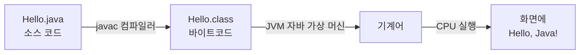
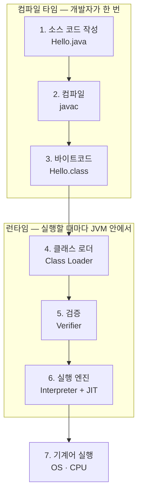

오늘은 자바 첫 수업. JDK 21을 함께 설치하고, 우리가 쓴 자바 코드가 내 컴퓨터 안에서 어떤 길을 거쳐 실행되는지 따라가 봤어.

## 1. 오늘의 여정: 소스 코드가 화면에 나타나기까지

`Hello.java`라는 글자 덩어리가 화면에 `Hello, Java!`로 나타나기까지, 사실 다섯 정거장을 거쳐.



오늘 배우는 건 딱 이 다섯 정거장이야: 소스 코드 → 컴파일러 → 바이트코드 → JVM → CPU. 하나씩 뜯어보자.

## 2. JDK는 러시아 인형처럼 생겼다

JDK(자바 개발 키트, Java Development Kit)는 자바 프로그램을 만들고 실행하는 데 필요한 모든 걸 한 상자에 담은 꾸러미야. 근데 이 상자, 열어보면 안에 작은 상자가, 그 안에 또 작은 상자가 들어 있어. 마트료시카 인형처럼 말이야.

다섯 살 아이에게 설명한다면 이렇게 말할 것 같아: "제일 큰 인형(JDK) 안에 중간 인형(JRE)이 있고, 그 안에 제일 작은 인형(JVM)이 들어있어. 제일 큰 인형 하나만 사면, 사실 그 안에 있는 작은 인형들도 전부 같이 따라오는 거야."


가장 바깥이 JDK, 그 안이 JRE, 가장 안쪽이 JVM.

| 층 | 이름 | 들어있는 것 |
|---|---|---|
| 가장 바깥 | **JDK**<br/>자바 개발 키트 | `javac`, `java`, `jshell`, `javap`, `jar`, `javadoc`, `jdb` |
| 중간 | **JRE**<br/>자바 실행 환경 | `java.lang`, `java.util`, `java.io`, `java.time`, `java.net` 같은 표준 라이브러리 |
| 가장 안쪽 | **JVM**<br/>자바 가상 머신 | 클래스 로더, 바이트코드 검증기, 실행 엔진, 메모리 관리 |

JVM은 바이트코드(`.class`)를 읽어서 지금 이 컴퓨터(Windows, macOS 등)가 알아듣는 기계어로 바꿔 실행해. 내 컴퓨터 안에 만든 "자바 전용 가상 컴퓨터"라서 가상 머신이라고 불러. 비유하자면 **통역사**야 — 자바가 하는 말을 듣고, 지금 이 컴퓨터가 알아듣는 말로 바로바로 옮겨주는 사람.

우리는 JDK 하나만 설치하면 돼. JDK 안에 JRE와 JVM이 모두 들어 있어서, 코드를 만들 수도 있고 실행할 수도 있어.

설치가 끝나면 JDK 폴더의 `bin` 안에 도구들이 실행 파일(`.exe`)로 들어 있어.

| 도구 | 이름 | 하는 일 |
|---|---|---|
| `javac.exe` | 컴파일러 (Compiler) | 사람이 쓴 `.java` 파일을 JVM이 읽는 바이트코드(`.class`)로 번역. 문법 오류가 있으면 여기서 알려줌 |
| `java.exe` | 실행기 | 바이트코드를 JVM 위에서 실행 |
| `jshell.exe` | 대화형 도구 | 코드를 한 줄씩 바로 실행해보는 도구 |
| `javap.exe` | 역어셈블러 | 바이트코드 내용을 사람이 읽을 수 있게 보여줌 |
| `jar.exe` | 압축기 | 여러 `.class` 파일을 하나로 묶음 |
| `javadoc.exe` | 문서 생성기 | 소스 코드 주석에서 API 문서를 만듦 |
| `jdb.exe` | 디버거 | 실행 중인 자바 프로그램을 한 줄씩 추적 |

오늘 수업에서 실제로 쓸 건 `javac.exe`와 `java.exe` 두 개뿐이야.

## 3. 왜 하필 JDK 21일까

자바는 2018년부터 6개월마다(매년 3월과 9월) 새 버전이 나와. 그중 일부를 **LTS(장기 지원, Long-Term Support)** 버전으로 정해서 몇 년 동안 보안·버그 수정을 이어가. 회사도, 수업도 보통 LTS 버전을 써.

| 버전 | 출시 | LTS 여부 |
|---|---|---|
| Java 8 | 2014.03 | LTS |
| Java 11 | 2018.09 | LTS |
| Java 17 | 2021.09 | LTS |
| **Java 21** | **2023.09** | **LTS ← 우리 수업** |
| Java 25 | 2025.09 | LTS (최신) |

LTS는 몇 년간 업데이트 지원을 받지만, 일반 버전(9~10, 18~20, 22~24 같은)은 다음 버전이 나오면 지원이 끝나. 그래서 우리는 굳이 최신 LTS(25)가 아니라 21을 골랐어. 이유는 세 가지야.

1. **오래 지원받는 LTS다** — 보안 업데이트가 여러 해 동안 계속 나와서, 배운 환경 그대로 프로젝트까지 안심하고 쓸 수 있어.
2. **Spring과 잘 맞는다** — 다음 모듈에서 쓸 최신 Spring Boot는 Java 17 이상을 요구해. 21은 이 조건을 넉넉히 채우고 현업에서도 널리 써.
3. **검증이 끝난 버전이다** — 최신 LTS는 25지만, 21은 자료·라이브러리·회사 사례가 충분히 쌓였어. 21에서 배운 문법은 25에서도 그대로 동작해.

자바의 원본 소스는 **OpenJDK**라는 오픈소스 프로젝트에 공개되어 있어. 여러 회사가 같은 원본으로 JDK를 만들어 배포하기 때문에, 이름은 달라도 기능은 거의 같아.

| 배포판 | 만드는 곳 |
|---|---|
| Eclipse Temurin | Eclipse 재단의 Adoptium 프로젝트, 무료 — **오늘 이걸 설치** |
| Oracle JDK | 자바를 관리하는 Oracle |
| Amazon Corretto | Amazon, 무료 |
| Microsoft Build of OpenJDK | Microsoft, 무료 |

## 4. JDK 21 설치하기 (Windows)

**1) 내려받기.** [adoptium.net](https://adoptium.net)의 Temurin 다운로드 페이지에서 Windows / x64 / JDK / **21 - LTS**를 골라 `.msi` 파일을 받아. 첫 화면의 큰 다운로드 버튼을 조심해야 해 — 최신 LTS(25)가 받아질 수 있거든. 버전이 21인지 꼭 확인하자. 내 PC가 x64인지 궁금하면 설정 → 시스템 → 정보에서 "시스템 종류"를 확인하면 돼.

**2) 설치 옵션 고르기.** 설치 마법사에서 **Add to PATH**를 켜둔 채로 진행해. 이게 다음 단계에서 중요해져.

**3) PowerShell 새로 열기.** 설치 후에는 PATH가 이미 열려 있던 창에는 반영이 안 돼. 새 창을 열어야 해.

**4) 설치 확인.** `java -version`을 입력해서 21이 나오는지 확인.

여기서 궁금한 게 하나 생겨. `java`라고 입력하면 컴퓨터는 그 프로그램을 어떻게 찾을까?

PowerShell에 `java`를 입력하면, Windows는 **PATH(경로) 환경 변수**에 적힌 폴더를 위에서부터 차례로 열어보며 `java.exe`를 찾아. 설치 때 켜둔 "Add to PATH"가 이 목록에 JDK 폴더를 추가해준 거야.

```
C:\Windows\system32
C:\Windows
C:\Windows\System32\WindowsPowerShell\v1.0
C:\Program Files\Git\cmd
C:\Program Files\Eclipse Adoptium\jdk-21.0.x-hotspot\bin   ← 여기서 java.exe 발견
C:\Users\student\AppData\Local\Microsoft\WindowsApps
```

덕분에 어느 폴더에서든 `java`, `javac`를 바로 입력할 수 있는 거야. 비슷하게 **JAVA_HOME**이라는 것도 있는데, 이건 JDK가 설치된 폴더 주소 하나만 가리켜. IntelliJ, Gradle, Spring 같은 도구가 JDK 위치를 알아낼 때 이 값을 봐.

## 5. 실행 원리: 코드는 두 번 번역된다

자바 프로그램은 두 번 번역돼. 개발자 컴퓨터에서 **한 번** 바이트코드로 번역하고(컴파일), 실행할 때마다 JVM이 그 바이트코드를 내 컴퓨터의 기계어로 **다시** 통역해.



**소스 코드 작성**은 사람이 읽고 쓸 수 있는 자바 문법으로 `Hello.java` 파일을 만드는 단계야. 아직 컴퓨터는 이 글을 이해하지 못해. 영어로 쓴 편지를 한국어만 아는 사람에게 건넨 상황과 같아. (파일 이름과 `public class` 이름은 반드시 똑같아야 해 — `Hello.java` 안에는 `class Hello`.)

여기서 자바의 유명한 원칙 하나가 나와: **한 번 작성하면, 어디서나 실행(Write Once, Run Anywhere)**. 바이트코드는 특정 CPU가 아니라 JVM을 위한 명령어야. 그래서 Windows에서 만든 `Hello.class` 하나를 Mac이나 Linux로 그대로 가져가도, 그 컴퓨터의 JVM이 자기 CPU에 맞는 기계어로 통역해줘.

| 컴퓨터 | JVM | 실제 기계어 | 출력 |
|---|---|---|---|
| Windows PC | Windows용 JVM | x64 기계어 | Hello, Java! |
| Mac (Apple 칩) | macOS용 JVM | ARM 기계어 | Hello, Java! |
| Linux 서버 | Linux용 JVM | x64 기계어 | Hello, Java! |

`Hello.class` 파일은 딱 하나인데, 실행하는 컴퓨터마다 그 운영체제용 JVM만 있으면 돼. C 같은 언어는 운영체제마다 따로 컴파일한 실행 파일을 만들어야 하는 것과 대조적이야. 오늘 JDK를 설치한 이유가 바로 이거야 — JVM이 있어야 이 통역이 가능하니까.

## 6. 직접 실행해보기

메모장에 아래 코드를 그대로 입력해서 `Hello.java`로 저장해.

```java
// 첫 번째 자바 프로그램
public class Hello {
    // 프로그램이 시작되는 곳 (main 메서드)
    public static void main(String[] args) {
        // 화면에 한 줄 출력하기
        System.out.println("Hello, Java!");
    }
}
```

지켜야 할 규칙 세 가지.

- **파일 이름 = 클래스 이름** — `public class Hello`라면 파일 이름은 반드시 `Hello.java`.
- **대소문자를 구분한다** — `hello`와 `Hello`, `system`과 `System`은 서로 다른 이름.
- **문장 끝에는 세미콜론** — 명령 한 줄이 끝나면 `;`를 붙인다. 빠뜨리면 컴파일 에러.

```powershell
PS> javac Hello.java   # 컴파일 → Hello.class 생성
PS> java Hello         # 실행 (확장자 없이 클래스 이름만)
```

자주 나는 에러 세 가지는 미리 알아두면 당황하지 않아.

| 에러 메시지 | 원인 |
|---|---|
| `class hello is public, should be declared in a file named hello.java` | 클래스 이름과 파일 이름이 달라. 대소문자까지 똑같이 맞추기 |
| `';' expected` | 세미콜론이 빠졌어. 에러 메시지의 줄 번호를 확인 |
| `Could not find or load main class Hello.class` | 실행할 때는 확장자를 빼고 `java Hello`처럼 클래스 이름만 적기 |

한 걸음 더 나가보고 싶다면:

- `java Hello.java` — 파일 하나짜리 프로그램은 컴파일 없이 바로 실행할 수 있어. 단, 같은 폴더에 `Hello.class`가 있으면 에러가 나니 빈 폴더에서 해보자.
- `Format-Hex Hello.class` — PowerShell로 `.class` 파일의 첫 바이트를 직접 확인해보면 `CA FE BA BE`가 보여. 모든 자바 바이트코드 파일이 이 매직 넘버로 시작해.
- `jshell` — 코드를 한 줄씩 바로 실행해보는 대화형 도구. 끝낼 때는 `/exit`.

## 7. 확인 퀴즈

**1. `Hello.java`를 `Hello.class`로 번역해주는 JDK 도구는?**
`java` / **`javac`** / `jshell` / `jar`
→ 정답: `javac`. 컴파일러가 소스 코드를 바이트코드로 번역해.

**2. 우리가 JRE가 아니라 JDK를 설치하는 이유는?**
JDK가 실행 속도가 더 빨라서 / **코드를 번역하는 javac 같은 개발 도구가 JDK에만 있어서** / JRE는 Windows에서 동작하지 않아서 / JDK에는 JVM이 들어 있지 않아서
→ 정답: JRE는 실행 환경만 담고 있고, 컴파일 도구는 JDK에만 있어.

**3. `java`를 입력했을 때 Windows가 `java.exe`를 찾으려고 차례로 살펴보는 폴더 목록은?**
`JAVA_HOME` / **`PATH`** / `bin` / `System32`
→ 정답: `PATH`. `JAVA_HOME`은 폴더 주소 하나만 가리키는 값이고, 실제 탐색은 `PATH`에 적힌 폴더들을 순서대로 뒤지는 방식이야.

**4. Windows에서 만든 `Hello.class`를 Mac에서도 실행할 수 있는 이유는?**
Mac이 Windows 프로그램을 그대로 실행할 수 있어서 / javac가 모든 운영체제용 기계어를 한꺼번에 만들어서 / **바이트코드는 JVM용 명령어이고, 각 운영체제의 JVM이 통역해주어서** / 인터넷에서 자동으로 변환되어서
→ 정답: 바이트코드는 특정 CPU가 아니라 JVM을 위한 공통 명령어야.

**5. 같은 코드가 자주 반복될 때, 그 부분을 기계어로 번역해 저장해서 빠르게 만드는 것은?**
클래스 로더 / 바이트코드 검증기 / **JIT 컴파일러** / javadoc
→ 정답: JIT(Just-In-Time) 컴파일러. 실행 엔진 안에서 인터프리터와 함께 일해.

## 오늘의 정리

자바 코드는 `javac`가 바이트코드로 한 번 번역하고, 실행할 때마다 JVM이 그 바이트코드를 내 컴퓨터의 기계어로 다시 통역해. 이 "한 번 번역, 어디서나 실행" 구조 덕분에 같은 `.class` 파일 하나로 Windows든 Mac이든 실행할 수 있어. 오늘 설치한 JDK 21은 그 번역·실행 도구를 전부 담고 있는 상자였고.

## 더 학습하면 좋은 개념

- **바이트코드 매직 넘버(`CAFEBABE`)와 클래스 파일 구조** — `.class` 파일이 실제로 어떤 바이트들로 이루어져 있는지 알면, "바이트코드"라는 말이 추상적인 개념이 아니라 진짜 파일 포맷이라는 걸 체감할 수 있어.
- **JIT 컴파일러의 동작 원리** — 실행 엔진은 인터프리터와 JIT 컴파일러를 함께 써. 왜 자주 실행되는 코드만 기계어로 미리 번역해두는지 알면 "자바가 느리다"는 오해가 왜 절반만 맞는 말인지 이해하게 돼.
- **가비지 컬렉션(Garbage Collection)** — JVM의 메모리 관리 부분이 오늘 다룬 "실행 엔진" 옆에 있었어. 자바가 메모리 해제를 어떻게 자동으로 처리하는지는 다음 단계에서 꼭 필요한 개념이야.
- **자바 모듈 시스템(JPMS)** — Java 9부터 JDK 자체도 모듈 단위로 쪼개졌어. `java.base`, `java.desktop` 같은 이름을 마주치기 시작하면 이 개념을 먼저 봐야 해.

