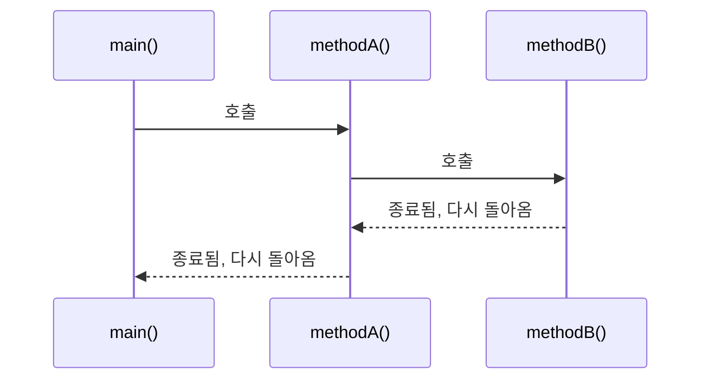
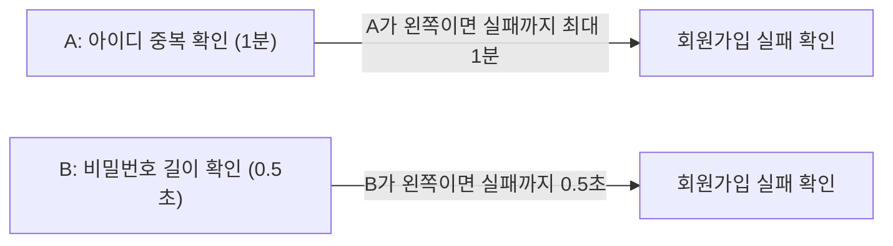

오늘은 백엔드 수업에서 조건문, 반복문, 메소드를 배웠는데 솔직히 좀 힘들었다(ㅜㅜ). 그런데 정리하면서 보니 셋 다 결국 하나의 고민에서 나온 도구였다 — **"같은 코드를 왜 두 번, 세 번 써야 하지?"**

## 1. 메소드가 없으면 생기는 문제

가장 먼저 배운 게 메소드였는데, 왜 필요한지부터 코드로 보여줬다.

```java
int num1 = 1;
int num2 = 2;
System.out.println("1번째 연산 결과: " + (num1 + num2));

int num3 = 3;
int num4 = 4;
System.out.println("2번째 연산 결과: " + (num3 + num4));
```

두 수를 더하고 싶을 때마다 변수 선언 2줄, 연산+출력 1줄이 계속 반복된다. 이걸 아래처럼 하나의 덩어리로 묶어두면, 그다음부터는 필요할 때마다 이름만 불러 쓰면 된다.

```java
public int sumTwoNumber(int a, int b) {
    return a + b;
}
```

```java
Application01 app = new Application01();
System.out.println("3번 째 연산: " + app.sumTwoNumber(5, 6));
System.out.println("4번 째 연산: " + app.sumTwoNumber(7, 8));
System.out.println("5번 째 연산: " + app.sumTwoNumber(9, 10));
```

메소드는 **특정 작업을 수행하는 코드 블록**이다. 형식은 이렇다.

```
[접근제어자] [반환 타입] 메소드명([매개변수 타입 매개변수명]) {
    실행할 코드
    [return 반환값;]
}
```

호출은 `클래스명 변수명 = new 클래스명();`으로 준비한 뒤 `변수명.메소드명()`으로 부른다. 처음엔 `new`가 왜 필요한지 헷갈렸는데, "이 메소드를 쓰려면 그 메소드가 들어있는 상자(인스턴스)부터 하나 만들어야 한다"고 생각하니 이해가 됐다.

### 메소드 호출은 순서대로, 그리고 반드시 돌아온다

메소드 안에서 다른 메소드를 부르면 어떻게 될까 확인해본 코드다.

```java
public static void main(String[] args) {
    System.out.println("main() 시작됨...");
    Application02 app2 = new Application02();
    app2.methodA();
    System.out.println("main() 종료됨...");
}

public void methodA() {
    System.out.println("methodA() 호출됨...");
    methodB();
    System.out.println("methodA() 종료됨...");
}

public void methodB() {
    System.out.println("methodB() 호출됨...");
}
```



`main()`이 항상 가장 먼저 시작되고, `methodA()`를 부르면 그 안에서 실행이 끝날 때까지 `main()`은 멈춰서 기다린다. `methodA()` 안에서 `methodB()`를 부르는 순간도 마찬가지다 — 안으로, 안으로 들어갔다가, 끝난 순서의 **역순**으로 하나씩 되돌아온다.

## 2. 조건문 — 상황에 따라 다른 코드를 실행하기

### if-else: 나이별 할인율 계산

```java
Scanner sc = new Scanner(System.in);
System.out.println("나이를 입력해주세요 : ");
int age = sc.nextInt();

double discountRate;
if (age < 13) {
    discountRate = 0.5;
} else if (age >= 65) {
    discountRate = 0.3;
} else {
    discountRate = 0.0;
}
```

| 조건 | 할인율 |
|---|---|
| `age < 13` | 50% |
| `age >= 65` | 30% |
| 그 외 | 0% |

### switch: 조건이 많을 때 if-else 대신

조건이 두세 개를 넘어가면 `if-else`를 계속 이어붙이는 대신 `switch`를 쓸 수 있다.

```java
switch (month) {
    case 1:
        System.out.println("1월~");
        break;
    case 2:
        System.out.println("2월~");
        break;
    case 3:
        System.out.println("3월~");
        break;
    default:
        System.out.println("그 외의 월입니다!");
}
```

`case`는 값이 일치할 때 실행할 코드, `break`는 그 지점에서 switch 블록을 빠져나가는 역할, `default`는 `if-else`의 `else`에 해당한다. `break`를 빼먹으면 그다음 `case`까지 이어서 실행돼버리는데(이건 오늘 직접 겪은 실수는 아니지만 나중에 조심해야 할 부분이라 적어둔다).

### 단축 평가 — `&&`와 `||`는 순서가 성능에 영향을 준다

가장 흥미로웠던 부분. `&&`(AND)는 왼쪽이 거짓이면 오른쪽은 아예 실행하지 않고 바로 `false`로 끝나버린다. 이걸 **단축 평가(short-circuit evaluation)**라고 부른다.

수업에서 든 예시: 회원가입 조건이 `if (A && B)`이고, A는 "아이디 중복 확인"(1분 걸림), B는 "비밀번호 8자 미만 확인"(0.5초 걸림)이라면?



| 좌항에 두는 조건 | 실패를 확인하는 데 걸리는 시간 |
|---|---|
| A(1분 걸리는 검사)를 좌항에 | 최대 1분 |
| B(0.5초 걸리는 검사)를 좌항에 | 최대 0.5초 |

원칙은 이렇다.

- **AND(`&&`)**: 거짓일 확률이 높은 조건을 왼쪽에 둔다. 왼쪽이 거짓이면 오른쪽은 평가하지 않기 때문이다.
- **OR(`||`)**: 참일 확률이 높은 조건을 왼쪽에 둔다. 왼쪽이 참이면 오른쪽은 평가하지 않기 때문이다.

트래픽이 많거나 검사 비용이 큰 서비스일수록 이 순서 하나가 실제 성능 차이로 이어진다는 게 신기했다.

## 3. 반복문 — for, while, do-while

### for: 몇 번 반복할지 정해져 있을 때

```java
for (int i = 1; i <= 5; i++) {
    if (i % 2 == 0) {
        System.out.println("침묵함...");
    } else {
        System.out.println("성원님" + i + "번 했습니다~");
    }
}
```

`초기식; 조건식; 증감식` 세 부분으로 반복 횟수를 직접 제어한다. 여기서 헷갈리지 말아야 할 부분은, `i%2==0`(짝수)일 때 **아무 것도 출력하지 않는 게 아니라** "침묵함..."이라는 문자열을 출력한다는 것이다. 즉 이 반복문은 5번 도는 동안 **매번 한 줄씩, 총 5줄**을 출력한다.

### while: 반복 횟수가 정해져 있지 않을 때

```java
int count = 0;
while (count <= 5) {
    System.out.println("카운트 : " + count);
    count++;
}
```

조건식이 참인 동안 반복한다는 점은 `for`와 같지만, 초기식·증감식을 강제하는 형식이 없어서 "언제 끝날지 조건에 따라 달라지는" 상황에 더 자연스럽다.

### do-while: 일단 한 번은 실행하고 본다

```java
int num = 5;
do {
    System.out.println("0~2까지만 반복 출력  : " + num);
    num++;
} while (num < 3);
```

이 코드는 직접 돌려보고서야 이해했다. 주석은 "0~2까지만 반복 출력"이라고 되어 있지만, `num`은 5에서 시작하고 조건은 `num < 3`이라 **처음부터 거짓**이다. 그런데도 `do-while`은 **몸통을 먼저 한 번 실행하고 나서** 조건을 확인하기 때문에, `"0~2까지만 반복 출력 : 5"`가 딱 한 번 출력되고 끝난다.

다섯 살 아이에게 설명한다면: "while은 방에 들어가기 전에 '들어가도 돼?'부터 물어보는 거고, do-while은 일단 방에 한 발 들여놓고 나서야 '어, 여기 들어와도 되는 곳이었나?'를 확인하는 거야. 그래서 안 되는 방이었어도 일단 한 번은 들어가 본 거지."


| 반복문 | 조건 확인 시점 | 조건이 처음부터 거짓이면 |
|---|---|---|
| `while` | 실행 전에 먼저 확인 | 한 번도 실행되지 않는다 |
| `do-while` | 실행 후에 확인 | 그래도 최소 1번은 실행된다 |

주석과 실제 동작이 다르게 보이는 이 코드 덕분에, `do-while`의 "무조건 최소 1회 실행"이라는 특징이 훨씬 확실하게 남았다.

## 오늘의 정리

메소드는 "코드를 다시 쓰지 않기 위한" 도구, 조건문은 "상황에 따라 다른 길로 가기 위한" 도구, 반복문은 "같은 동작을 여러 번 하지 않고 한 번만 적기 위한" 도구였다. 셋 다 결국 같은 문제 — **반복 작업을 줄이는 것** — 를 서로 다른 각도에서 풀고 있다는 게 오늘의 가장 큰 수확이었다.

## 더 학습하면 좋은 개념

- **메소드 오버로딩(overloading)** — 오늘은 `sumTwoNumber(int, int)` 하나만 봤는데, 같은 이름으로 매개변수 타입·개수가 다른 메소드를 여러 개 만들 수 있다. 왜 이름 하나로 여러 동작을 표현할 수 있는지 알아두면 좋다.
- **재귀 호출(recursion)** — `methodA()`가 `methodB()`를 부르는 것처럼, 메소드가 자기 자신을 부르는 경우도 있다. 호출이 안으로 들어갔다가 역순으로 되돌아온다는 오늘의 감각이 재귀를 이해하는 데 그대로 이어진다.
- **switch 표현식(switch expression, Java 14+)** — `break`를 매번 써야 하는 옛날 방식 대신, `case 1 -> ...;`처럼 화살표로 더 간결하게 쓰는 문법이 있다.
- **for-each문** — 오늘 배운 `for`는 숫자를 세는 용도였는데, 배열이나 컬렉션을 순회할 때는 `for (타입 변수 : 배열)` 형태를 훨씬 자주 쓴다.

## 참고 자료

- [Oracle Java Tutorials - Classes and Objects (메소드 정의)](https://docs.oracle.com/javase/tutorial/java/javaOO/methods.html)
- [Oracle Java Tutorials - The if-then and if-then-else Statements](https://docs.oracle.com/javase/tutorial/java/nutsandbolts/if.html)
- [Oracle Java Tutorials - The switch Statement](https://docs.oracle.com/javase/tutorial/java/nutsandbolts/switch.html)
- [Oracle Java Tutorials - The while and do-while Statements](https://docs.oracle.com/javase/tutorial/java/nutsandbolts/while.html)
- [Oracle Java Tutorials - The for Statement](https://docs.oracle.com/javase/tutorial/java/nutsandbolts/for.html)
