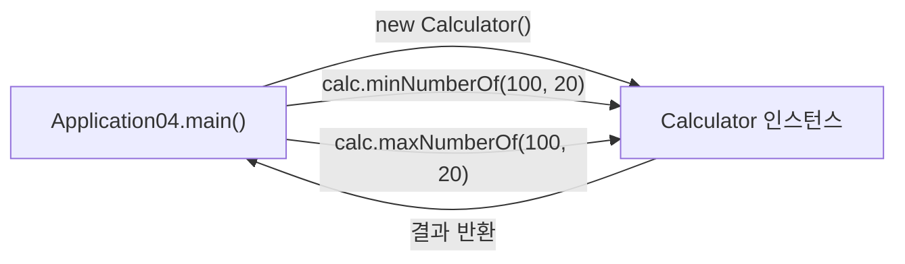

어제는 메소드를 "왜 쓰는지"와 "순서대로 호출된다"까지만 봤는데, 오늘은 메소드를 더 자유롭게 쓰는 법 세 가지를 배웠다 — 여러 타입을 한 번에 넘기기, 다른 클래스의 메소드 불러 쓰기, 그리고 if-else를 한 줄로 줄이는 삼항연산자.

## 1. 매개변수에는 여러 타입을 한 번에 섞을 수 있다

```java
Application03 app3 = new Application03();
int age = app3.testMethod(40, "문자열", true, 'ㅇ');
System.out.println("당신의 나이는 " + age + "입니다");

public int testMethod(int a, String s, boolean b, char c) {
    return a;
}
```

지금까지는 `sumTwoNumber(int a, int b)`처럼 같은 타입끼리만 넘겼는데, 매개변수는 타입이 전부 달라도 괜찮다. `int`, `String`, `boolean`, `char`를 한 메소드에 동시에 넘길 수 있다는 걸 이 코드로 확인했다.

메소드 형식에 적혀 있던 `[접근제어자]`도 오늘 제대로 짚었다.

| 접근제어자 | 접근 가능 범위 |
|---|---|
| `public` | 모든 클래스에서 접근 가능 |
| `protected` | 같은 패키지 또는 자식 클래스에서 접근 가능 |
| (작성하지 않음, default) | 같은 패키지 내에서만 접근 가능 |
| `private` | 같은 클래스 내부에서만 접근 가능 |

## 2. 다른 클래스의 메소드도 불러 쓸 수 있다

지금까지는 전부 "내 클래스 안의 메소드"만 호출했는데, 오늘은 아예 다른 클래스에 있는 메소드를 불러 쓰는 코드를 봤다.

```java
// Calculator.java
public class Calculator {
    public int minNumberOf(int a, int b) {
        return (a > b) ? b : a;
    }
    public int maxNumberOf(int a, int b) {
        return (a > b) ? a : b;
    }
}
```

```java
// Application04.java
Calculator calc = new Calculator();
int min = calc.minNumberOf(first, second);
int max = calc.maxNumberOf(first, second);
```



원리는 어제 배운 것과 같다 — `클래스명 변수명 = new 클래스명();`으로 인스턴스를 만들고 `변수명.메소드명()`으로 부르는 것. 다른 점은 그 인스턴스가 "내 클래스"가 아니라 **다른 파일에 있는 `Calculator` 클래스**라는 것뿐이었다. 기능별로 클래스를 나눠두면(계산기는 계산기 클래스에, 실행은 실행 클래스에) 필요할 때 가져다 쓰기만 하면 된다는 게 신기했다.

## 3. 삼항연산자로 if-else를 한 줄로 줄이기

`Calculator`의 `minNumberOf`를 보면 `if-else` 없이 한 줄로 최솟값을 구하고 있다.

```java
public int minNumberOf(int a, int b) {
    return (a > b) ? b : a;
}
```

이게 **삼항연산자(조건 연산자)**다. 형식은 `조건 ? 참일 때 값 : 거짓일 때 값`.

| 방식 | 코드 |
|---|---|
| if-else로 쓰면 | `if (a > b) { return b; } else { return a; }` |
| 삼항연산자로 쓰면 | `return (a > b) ? b : a;` |

`a > b`가 참이면(즉 a가 더 크면) 더 작은 쪽인 `b`를 반환하고, 거짓이면 `a`를 반환한다. 조건에 따라 값 하나만 골라서 바로 반환할 때는 `if-else` 네 줄보다 이 한 줄이 훨씬 간결했다.

## 오늘의 정리

메소드는 같은 타입끼리만 주고받는 게 아니라 여러 타입을 섞어 받을 수 있고, 내 클래스뿐 아니라 다른 클래스의 메소드도 인스턴스만 만들면 그대로 가져다 쓸 수 있었다. 그리고 "조건에 따라 값 하나를 고르기만 하면 되는" 간단한 분기는 삼항연산자로 더 짧게 쓸 수 있다는 것도 확인했다.

## 더 학습하면 좋은 개념

- **메소드 오버로딩(overloading)** — 오늘은 `testMethod`처럼 매개변수를 섞어봤는데, 같은 이름의 메소드를 매개변수 타입·개수만 다르게 여러 개 만들 수도 있다. 왜 이름 하나로 여러 동작을 표현할 수 있는지 알아두면 좋다.
- **static 메소드 vs 인스턴스 메소드** — 오늘은 매번 `new`로 인스턴스를 만든 뒤 메소드를 호출했는데, `static`이 붙은 메소드는 인스턴스 없이 `클래스명.메소드명()`으로 바로 부를 수 있다. 왜 `Calculator calc = new Calculator();`가 필요했는지 이 개념과 비교해보면 명확해진다.
- **캡슐화(encapsulation)** — 오늘 배운 접근제어자 중 `private`가 왜 존재하는지와 연결된다. 클래스 내부 데이터를 외부에서 함부로 바꾸지 못하게 막는 이유를 알아두면 좋다.
- **삼항연산자 중첩의 함정** — 삼항연산자를 여러 번 이어 쓰면(`a ? b : c ? d : e`) 오히려 읽기 어려워진다. 언제까지가 "한 줄로 줄여도 되는" 선인지 감을 잡아두면 좋다.

## 참고 자료

- [Oracle Java Tutorials - Classes and Objects (메소드 정의)](https://docs.oracle.com/javase/tutorial/java/javaOO/methods.html)
- [Oracle Java Tutorials - Controlling Access to Members of a Class](https://docs.oracle.com/javase/tutorial/java/javaOO/accesscontrol.html)
- [Oracle Java Tutorials - Operators (조건 연산자 포함)](https://docs.oracle.com/javase/tutorial/java/nutsandbolts/operators.html)
