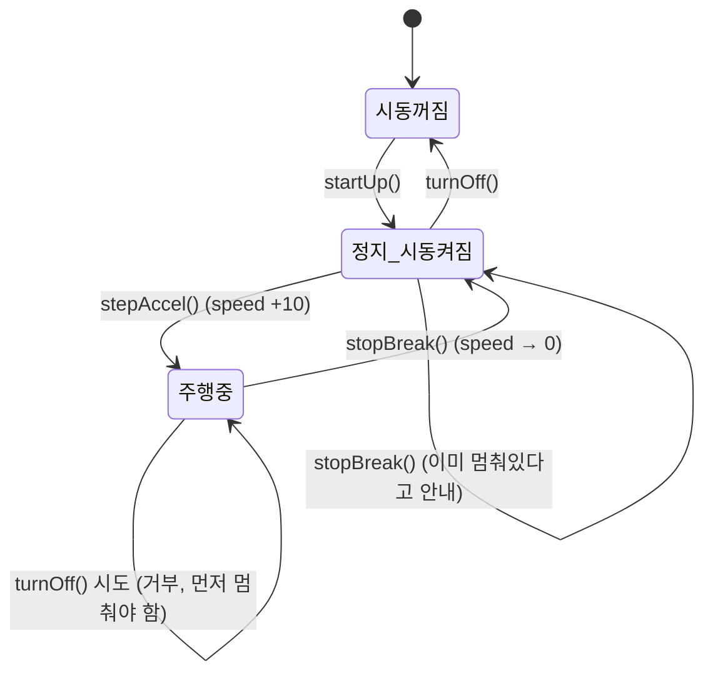

오늘은 몬스터 체력 관리 코드로 캡슐화를, 자동차-카레이서 시뮬레이션으로 추상화를 배웠다. 둘 다 "이렇게 하면 왜 문제가 생기는지"를 단계별 실패 코드로 먼저 보여주고, 그걸 어떻게 고쳐나가는지 따라가는 방식이라 훨씬 잘 와닿았다.

## 1. 캡슐화 — 필드를 함부로 열어두면 생기는 문제들

같은 `Monster` 클래스를 네 번 고쳐가며 캡슐화가 왜 필요한지 확인했다.

```java
public class Monster {
    String name;
    int hp;
}
```

### 문제 1 — 검증 없이 아무 값이나 들어간다

```java
Monster monster2 = new Monster();
monster2.name = "피카츄";
monster2.hp = -200;  // 체력이 음수가 되는데도 막을 방법이 없다
```

필드가 `public`이면 외부에서 `.hp`에 직접 대입할 수 있어서, 체력이 음수가 되는 것 같은 말도 안 되는 값도 그대로 들어간다.

### 문제 2 — 필드 이름 하나 바꿨을 뿐인데

요구사항이 바뀌어서 `name`을 `kinds`로 바꿨더니, `Application`에서 `monster.name`을 쓰던 모든 코드가 한 번에 컴파일 에러가 났다. 필드에 직접 접근하게 해두면, 그 필드를 쓰는 외부 코드 전부가 내부 변경에 그대로 영향을 받는다.

### 문제 3 — 메소드를 만들어도 필드가 열려 있으면 소용없다

그래서 `setHp()`, `setName()`, `getInfo()` 같은 메소드를 추가했다. 그런데도 여전히 구멍이 있었다.

```java
monster3.setHp(-200);     // 메소드를 거쳐서 검증(?)하고
monster3.hp = -5500;      // 그래도 필드가 public이라 그냥 직접 덮어쓸 수 있다
```

메소드로 검증 로직을 아무리 잘 만들어도, 필드 자체가 여전히 `public`이면 그 메소드를 건너뛰고 필드에 바로 접근하는 걸 막을 수 없었다.

### 해결 — `private`로 필드 자체를 막기

```java
private String kinds;
private int hp;
```

```java
// monster3.hp = -5500;  // 이제 컴파일 에러! 필드에 직접 접근 자체가 불가능
```

`private`를 붙이자 외부에서는 필드에 직접 접근하는 것 자체가 컴파일 에러가 됐다. 이제 `Monster`의 상태를 바꾸는 유일한 방법은 `setHp()`, `setName()` 같은 공개된 메소드뿐이다.

| 단계 | 필드 상태 | 남아있던 문제 |
|---|---|---|
| 문제 1 | `public`, 직접 대입 | 검증 없이 음수 체력 같은 값이 그대로 들어감 |
| 문제 2 | `public`, 직접 대입 | 필드명을 바꾸면 외부 코드 전체가 컴파일 에러 |
| 문제 3 | `public` + getter/setter | 메소드가 있어도 필드가 열려 있으면 직접 대입으로 우회 가능 |
| 해결 | **`private`** + getter/setter | 외부는 메소드로만 접근 가능, 필드 직접 접근은 컴파일 에러 |

> 코드를 읽다가 헷갈렸던 부분 하나: `setHp()`의 조건문 순서가 주석과 반대로 적혀 있었다. 주석은 "양수면 그대로 세팅, 음수면 0으로 강제"라고 되어 있는데, 실제 코드는 `if (hp < 0)`일 때 `this.hp = 0`으로 바꾸고, `else`(0 이상)일 때는 오히려 아무 것도 대입하지 않고 에러 메시지만 출력하고 있었다. 주석만 믿지 말고 조건문을 직접 따라가봐야 한다는 걸 또 한 번 느꼈다.

## 2. 추상화 — 복잡한 현실을 목적에 맞게 단순화하기

> 추상화란 공통된 부분을 추출하고, 공통되지 않는 부분은 제거해서 **현실세계를 프로그램의 목적에 맞게 단순화**하는 것이다.

오늘의 과제는 "카레이서가 자동차를 운전하는 프로그램"이었다.

- 자동차는 처음엔 멈춰 있다.
- 카레이서가 시동을 건다 (이미 걸려 있으면 다시 걸 수 없다).
- 엑셀을 밟으면 시동이 걸려 있을 때만 시속이 10km/h씩 올라간다.
- 브레이크를 밟으면 달리는 중이면 멈추고, 이미 멈춰 있으면 안내만 한다.
- 시동을 끄면 더 이상 움직이지 않는다 (단, 달리는 중에는 끌 수 없다).

### 객체 후보 찾는 법: "은/는, 이/가" 앞 명사

문장에서 "~은/는, ~이/가" 앞에 오는 단어가 대부분 클래스 후보라는 팁을 배웠다. 이 요구사항에서는 **카레이서**와 **자동차**, 두 객체가 나온다.

| 객체 | 받을 수 있는 메세지(=해야 할 일) |
|---|---|
| 카레이서(`CarRacer`) | 시동을 걸어라 / 엑셀을 밟아라 / 브레이크를 밟아라 / 시동을 꺼라 |
| 자동차(`Car`) | 시동을 걸어라 / 앞으로 가라 / 멈춰라 / 시동을 꺼라 |

### 자동차의 상태는 이렇게 흘러간다



`Car`는 `speed`와 `isOn`이라는 두 필드로 이 상태를 전부 표현하고 있었다.

```java
private int speed;
private boolean isOn;

public void go() {
    if (isOn) {
        this.speed += 10;
    } else {
        System.out.println("차의 시동이 걸려있지 않습니다.");
    }
}

public void turnOff() {
    if (isOn) {
        if (speed > 0) {
            System.out.println("달리는 상태에서는 시동을 끌 수 없습니다.");
        } else {
            this.isOn = false;
        }
    } else {
        System.out.println("이미 시동이 꺼져있습니다");
    }
}
```

### CarRacer는 Car를 감싸서 대신 말해준다

```java
public class CarRacer {
    private Car car = new Car();

    public void startUp() { car.startUp(); }
    public void stepAccel() { car.go(); }
    public void stopBreak() { car.stop(); }
    public void turnOff() { car.turnOff(); }
}
```

`Application`은 `Car`를 직접 알 필요가 없다. `CarRacer`에게 "시동 걸어", "엑셀 밟아"라고만 말하면, `CarRacer`가 자기 안에 가진 `Car` 인스턴스에게 그 일을 그대로 전달한다. `Application` 입장에서는 자동차의 내부 상태(`speed`, `isOn`)가 어떻게 생겼는지 전혀 몰라도 되고, 그저 "카레이서에게 네 가지 메세지를 보낼 수 있다"는 것만 알면 충분했다. 이게 바로 복잡한 걸 걷어내고 필요한 것만 남긴다는 추상화였다.

### 실행 루프에서는 객체를 한 번만 만든다

```java
Scanner sc = new Scanner(System.in);
CarRacer racer = new CarRacer();  // 반복문 밖에서 딱 한 번 생성

while (true) {
    // ...메뉴 출력...
    int no = sc.nextInt();
    switch (no) {
        case 1: racer.startUp(); break;
        case 2: racer.stepAccel(); break;
        case 3: racer.stopBreak(); break;
        case 4: racer.turnOff(); break;
        case 9: break;
    }
    if (no == 9) break;
}
```

`case 1` 안에서 `CarRacer racer = new CarRacer();`를 또 쓰면 메뉴를 고를 때마다 새 인스턴스가 생겨서 메모리 낭비라는 주석이 있었다. 객체는 반복문 밖에서 한 번만 만들고, 반복문 안에서는 그 객체의 메소드만 호출해야 한다는 걸 짚어둔 부분이었다.

## 오늘의 정리

캡슐화는 "필드를 막아서 검증되지 않은 상태 변화를 막는 것"이었고, 추상화는 "복잡한 현실을 프로그램 목적에 맞게 단순화해서 필요한 메시지만 주고받게 하는 것"이었다. 둘 다 결국 "외부에서 내부를 함부로 건드리지 못하게 하고, 꼭 필요한 통로만 열어둔다"는 점에서 맞닿아 있다는 생각이 들었다.

## 더 학습하면 좋은 개념

- **getter/setter의 관례적 이름** — 오늘은 `setHp()`, `setName()`을 썼는데, `kinds`를 읽어오는 `getKinds()`처럼 필드 이름과 짝을 맞춰 짓는 관례(getter/setter convention)를 알아두면 다른 사람 코드를 읽을 때도 바로 알아볼 수 있다.
- **상속(inheritance)과 다형성(polymorphism)** — 오늘은 `Car` 하나만 다뤘는데, "전기차", "트럭"처럼 종류가 늘어나면 공통 부분을 부모 클래스로 묶어내는 상속이 필요해진다. 캡슐화·추상화 다음으로 이어지는 자연스러운 흐름이다.
- **인터페이스(interface)** — "카레이서가 받을 수 있는 메세지 목록"처럼 객체가 무엇을 할 수 있는지만 약속하고 구현은 감추는 방식. 오늘 배운 추상화를 한 단계 더 밀어붙인 개념이다.
- **불변 객체(immutable object)** — 캡슐화로 필드를 막는 것보다 한 걸음 더 나아가서, 아예 생성 이후에는 값을 바꿀 수 없게 만드는 설계도 있다. `private` setter조차 없는 경우를 떠올려보면 좋다.

## 참고 자료

- [Oracle Java Tutorials - Controlling Access to Members of a Class](https://docs.oracle.com/javase/tutorial/java/javaOO/accesscontrol.html)
- [Oracle Java Tutorials - What Is an Object?](https://docs.oracle.com/javase/tutorial/java/concepts/object.html)
- [Oracle Java Tutorials - What Is a Class?](https://docs.oracle.com/javase/tutorial/java/concepts/class.html)
