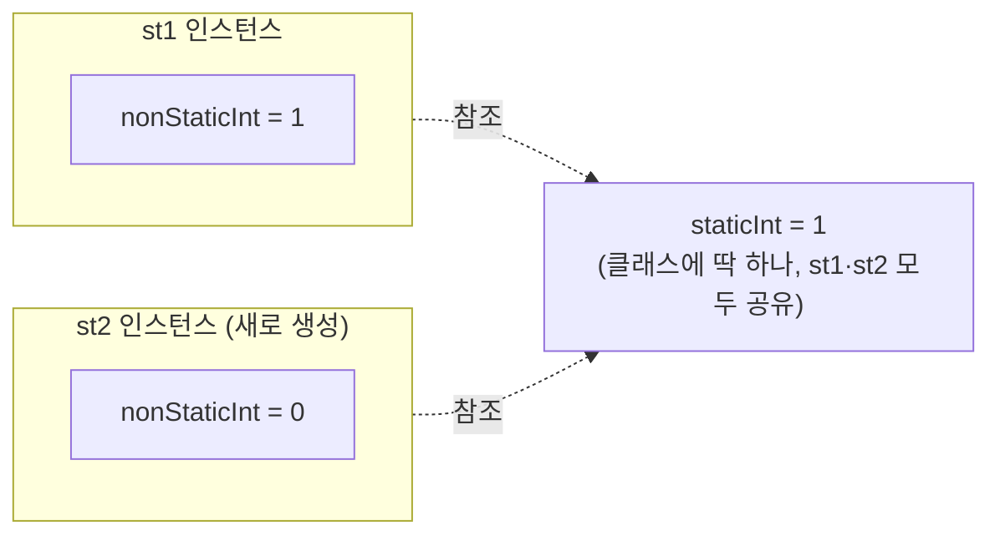
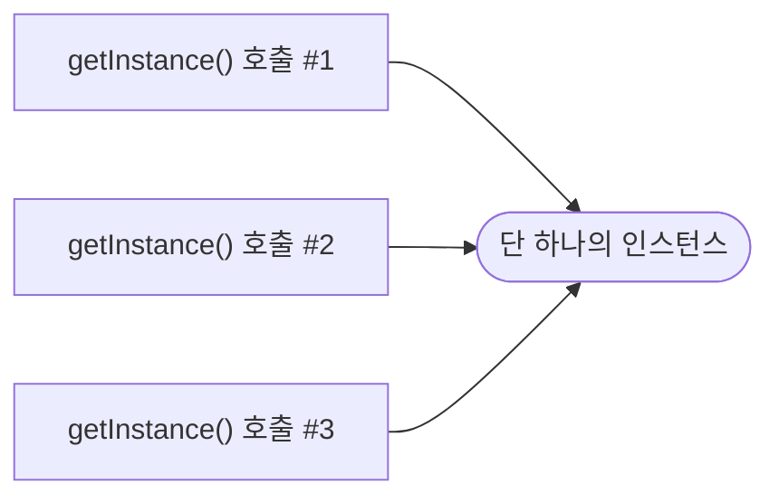

오늘 배운 세 가지 — `static`, 싱글톤 패턴, `final` — 는 전부 "값을 인스턴스 하나하나에 맡기지 않고 어떻게 통제할까"라는 하나의 질문으로 묶였다.

## 1. static — 인스턴스가 아니라 클래스에 속하는 값

`static`이 붙은 변수·메소드는 객체가 생성되는 시점이 아니라 **애플리케이션이 시작되는 시점**에 초기화되고, 모든 인스턴스가 하나를 공유한다.

```java
private int nonStaticInt;
private static int staticInt;

public void increaseNonStatic() { this.nonStaticInt++; }
public void increaseStatic() { StaticFieldTest.staticInt++; }  // this 대신 클래스명으로 접근
```

```java
StaticFieldTest st1 = new StaticFieldTest();
st1.increaseNonStatic();
st1.increaseStatic();

StaticFieldTest st2 = new StaticFieldTest();  // 새 인스턴스
// st2의 non-static 값은 0 (st1과 완전히 별개)
// st2의 static 값은 st1이 증가시킨 값 그대로 (모두가 공유하니까)
```

| 구분 | non-static | static |
|---|---|---|
| 소속 | 인스턴스마다 따로 | 클래스 전체가 공유 |
| 접근 방법 | `인스턴스.변수명` | `클래스명.변수명` |
| 초기화 시점 | 인스턴스 생성 시점 | 애플리케이션 시작 시점 |



`nonStaticInt`는 `st1`과 `st2`가 각자 따로 가지고 있어서 서로 영향이 없지만, `staticInt`는 클래스 전체에 딱 하나만 존재해서 `st1`이 증가시킨 값을 `st2`에서도 그대로 보게 된다.

## 2. 싱글톤 패턴 — 인스턴스를 딱 하나만

`static`을 응용하면, 애플리케이션 전체에서 인스턴스를 1개만 만들어 공유하는 **싱글톤 패턴**을 만들 수 있다. 리모컨처럼 여러 개 있을 필요 없이 하나만 있으면 되는 경우에 쓴다고 했다.

```java
public class EagerSingleton {
    private static EagerSingleton eager = new EagerSingleton();  // 이른 초기화(Eager)
    private EagerSingleton() {}  // 생성자를 private으로 막아서 외부에서 new 불가
    public static EagerSingleton getInstance() { return eager; }
}
```

```java
public class LazySingletion {
    private static LazySingletion lazy;
    private LazySingletion() {}
    public static LazySingletion getInstance() {
        if (lazy == null) {           // 게으른 초기화(Lazy) — 필요할 때 처음 생성
            lazy = new LazySingletion();
        }
        return lazy;
    }
}
```

생성자를 `private`으로 막아뒀기 때문에 `new EagerSingleton()`은 아예 불가능하고, 오직 `getInstance()`로만 받을 수 있다. 실제로 `eager1.hashCode()`와 `eager2.hashCode()`를 찍어보니 완전히 같은 값이 나와서, 정말 같은 인스턴스라는 걸 눈으로 확인할 수 있었다.



몇 번을 호출하든 `getInstance()`는 항상 같은 인스턴스 하나를 돌려준다. 생성자가 `private`이라 이 메소드를 거치지 않고는 애초에 새 인스턴스를 만들 방법이 없다.

## 3. final — 한 번 정해지면 끝

```java
private final int NON_STATIC_NUM = 1;     // 선언과 동시에 초기화
private final int NON_STATIC_NUM2;        // 선언만

public FinalFieldTest(int num) {
    this.NON_STATIC_NUM2 = num;           // 생성자에서 반드시 초기화
}
```

`final`이 붙은 변수는 두 가지 방법 중 하나로 **반드시** 초기화해야 한다 — 선언과 동시에, 또는 생성자 안에서. 그냥 선언만 하고 넘어가면(기본값 0이 들어가게 두면) 컴파일 에러가 난다는 게 신기했다. 초기화 이후에는 setter로도 값을 바꿀 수 없다. 관례상 `final` 변수는 대문자와 언더바(`NON_STATIC_NUM`)로 쓴다.

## 오늘의 정리

static·싱글톤·final은 공통적으로 "인스턴스 하나하나에 맡기지 않고 값을 통제하는 법"이었다. static은 "모두가 공유하게", 싱글톤은 "아예 하나만 존재하게", final은 "한 번 정해지면 더 못 바꾸게" — 통제하는 방향은 조금씩 다르지만 전부 "예측 가능한 상태"를 만들기 위한 도구였다.

## 더 학습하면 좋은 개념

- **`equals()`/`hashCode()` 오버라이드** — 싱글톤에서 `hashCode()`로 "같은 인스턴스인지" 확인했는데, 일반 객체에서 "값이 같으면 같은 객체로 볼지"를 정하려면 이 두 메소드를 직접 재정의해야 한다.
- **싱글톤의 스레드 안전성(thread safety)** — 오늘 배운 Lazy 싱글톤은 여러 스레드가 동시에 `getInstance()`를 호출하면 인스턴스가 2개 생길 수도 있다. 왜 그런 문제가 생기는지, `synchronized`로 어떻게 막는지는 다음 단계에서 볼 만하다.
- **정적 팩토리 메소드(static factory method)** — `getInstance()`처럼 `new` 대신 `static` 메소드로 객체를 돌려주는 패턴이 싱글톤 말고도 자주 쓰인다.
- **`static` 블록(static initializer)** — 오늘은 `static` 필드를 선언과 동시에 초기화했는데, 더 복잡한 초기화 로직이 필요할 때 쓰는 `static { ... }` 블록도 있다.

## 참고 자료

- [Oracle Java Tutorials - Understanding Class Members (static)](https://docs.oracle.com/javase/tutorial/java/javaOO/classvars.html)
- [Oracle Java Tutorials - More on Classes (final 포함)](https://docs.oracle.com/javase/tutorial/java/javaOO/variables.html)
