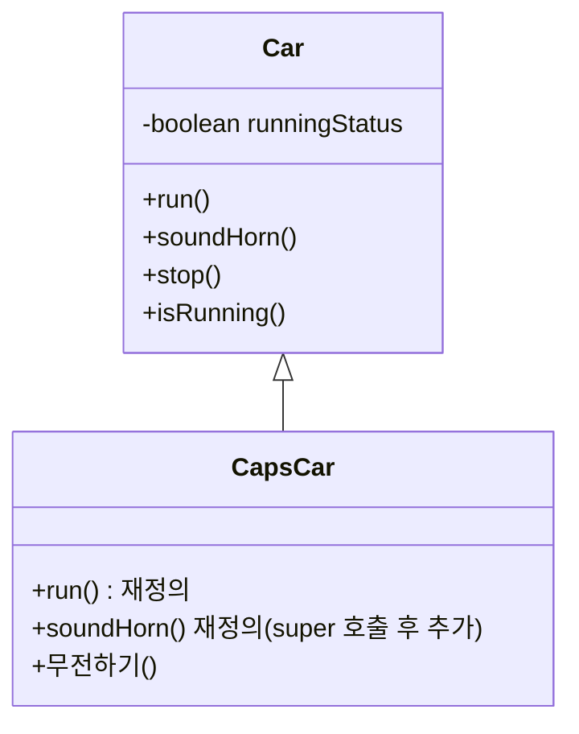
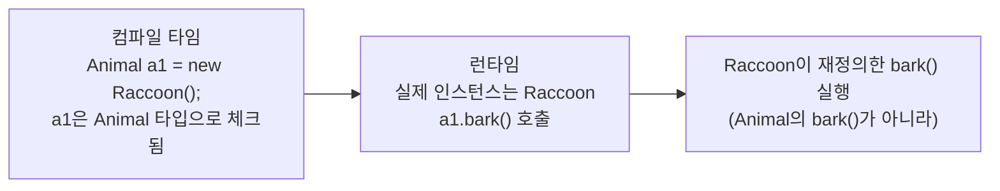

어제 static·싱글톤·final로 "값을 통제하는 법"을 봤다면, 오늘은 **다형성의 두 얼굴**을 배웠다. 오버로딩은 컴파일 시점에 어떤 메소드를 쓸지가 정해지는 **컴파일타임 다형성**이고, 상속·인터페이스를 거쳐 배운 오버라이딩은 실행 시점에 실제 동작이 정해지는 **런타임 다형성**이다. 같은 "다형성"이라는 이름 아래 전혀 다른 시점에 동작한다는 게 오늘 가장 크게 와닿은 부분이었다.

## 1. 오버로딩 — 컴파일 타임에 정해지는 다형성

**메소드 시그니처**는 메소드를 식별하는 고유한 값으로, `메소드명([매개변수])` 부분을 말한다. 시그니처가 같으면 아무리 다른 걸 바꿔도 에러가 난다.

```java
public void test() {}
public void test(int num) {}              // 매개변수 유무 → 오버로딩 성립
public void test(int num, String str) {}  // 매개변수 개수 → 오버로딩 성립
public void test(String str, int num) {}  // 매개변수 순서 → 오버로딩 성립
public void test2() {}                    // 이름 자체가 다르면 아예 다른 메소드
```

| 바꾼 부분 | 오버로딩이 성립하는가 |
|---|---|
| 매개변수 타입/개수/순서 | O — 새로운 메소드로 인정 |
| 매개변수 **이름**만 (`num` → `num2`) | X — 시그니처에 영향 없음, 에러 |
| 접근제한자만 (`public` → `private`) | X — 시그니처에 영향 없음, 에러 |
| 반환 타입만 | X — 시그니처에 영향 없음, 에러 |

접근제한자와 반환 타입은 시그니처에 포함되지 않는다는 게 가장 헷갈렸던 부분이다. "타입이 다르니까 되겠지"라고 생각했는데, 매개변수가 동일하면 반환 타입만 바꿔도 그냥 에러였다. 오버로딩은 **어떤 `test()`를 호출할지가 코드를 작성하는 시점(컴파일 타임)에 이미 매개변수로 결정**된다는 점에서, 뒤에서 볼 오버라이딩과 정반대 위치에 있다.

## 2. 상속 — 부모의 것을 물려받기

```java
public class Car {
    private boolean runningStatus;
    public void run() { runningStatus = true; System.out.println("자동차가 달려갑니다~~~~~~"); }
    public void soundHorn() {
        if (isRunning()) System.out.println("빵~~~~~~~~빵!!");
        else System.out.println("주행 중이 아니여서 경적을 울릴 수 없습니다.");
    }
}

// 경찰차는 차다 — IS-A 관계
public class CapsCar extends Car {
    @Override
    public void run() { System.out.println("경찰차는 삐용삐용~~ 하면서 달립니다!!"); }

    @Override
    public void soundHorn() {
        super.soundHorn();  // 부모의 동작을 먼저 그대로 실행하고
        System.out.println("✖️삐~~~용~~~삐~~~용~~~✖️");  // 자식만의 동작 추가
    }

    public void 무전하기() { System.out.println("치지지직..... 412에 성원몬 등장"); }  // 자식만의 고유 기능
}
```



반복되는 메소드(경적, 정지 등)는 부모 클래스에 한 번만 정의해두고, 자식은 상속만 받는다. 다르게 동작해야 하는 메소드만 `@Override`로 재정의하면 된다. `super.soundHorn()`은 부모의 구현을 그대로 가져다 쓴 뒤 자식만의 동작을 덧붙이는 패턴이었다.

다섯 살 아이에게 설명한다면: "엄마, 아빠한테 물려받은 물건은 그대로 써도 되고, 내 맘에 안 드는 것만 바꿔서 쓰면 돼. 그리고 나만 가지고 싶은 새 물건도 따로 가질 수 있어."


## 3. 인터페이스 — "할 수 있어야 하는 것"의 약속

```java
public interface Animal {
    void run();
    void eat();
    void bark();
}
```

인터페이스는 **Can-Do**, 즉 "이 인터페이스를 구현하는 클래스는 반드시 이 메소드들을 가지고 있어야 한다"는 약속이다. 생성자도, 구현부가 있는 메소드도 쓸 수 없다. `extends`가 아니라 `implements`로 상속받고, `new Animal()`처럼 인터페이스 자체로는 객체를 만들 수 없다 — 반드시 그걸 구현한 `Raccoon` 같은 클래스를 통해서만 인스턴스가 생긴다.

## 4. 다형성 — 런타임에 정해지는 다형성

```java
Animal a1 = new Raccoon();
a1.bark();            // Raccoon의 bark()가 호출된다 (오버라이딩된 버전으로)
// a1.bite();          // 컴파일 에러! a1은 "Animal 타입"이라 Raccoon 고유 기능을 모른다
((Raccoon) a1).bite(); // 형변환을 하면 Raccoon 고유 기능도 호출 가능
```

여기서 두 가지를 확실히 구분하게 됐다.

- **IS-A 관계**: "너구리는 동물이다"는 성립하지만(`Animal a1 = new Raccoon()` 가능), "동물은 너구리다"는 성립하지 않는다(`Raccoon r1 = new Animal()` 불가능).
- **동적 바인딩(dynamic binding)**: 컴파일 시점에는 `a1`이 `Animal` 타입 메소드와 연결되어 있지만, 런타임에는 실제 들어있는 인스턴스(`Raccoon`)가 오버라이딩한 메소드로 바뀌어 동작한다.



그래서 `a1.bite()`는 컴파일 시점에 막히지만(타입이 `Animal`이라 `bite()`라는 메소드 자체를 모름), `a1.bark()`는 컴파일도 되고 실행도 되는데 실제로는 `Raccoon`의 것이 실행된다 — "하나의 타입으로 여러 타입의 인스턴스를 다루면서, 호출은 각자 다르게 동작한다"는 다형성의 핵심을 직접 확인한 부분이었다.

## 오늘의 정리

오버로딩은 매개변수만 보고 **컴파일 시점**에 호출할 메소드가 정해지는 다형성이었고, 상속·인터페이스 위에서 동작하는 오버라이딩은 **실행 시점**에 실제 인스턴스를 보고서야 동작이 정해지는 다형성이었다. 상속은 "공통된 걸 부모에 모아두고 다른 부분만 재정의하는 법", 인터페이스는 "구현 없이 해야 할 일만 약속하는 법"이고, 이 둘이 합쳐져야 비로소 런타임 다형성이 가능해진다는 걸 오늘 연결해서 이해했다.

## 더 학습하면 좋은 개념

- **추상 클래스(abstract class)** — 인터페이스처럼 메소드 구현을 강제하면서도, 일부는 공통 구현을 미리 넣어둘 수 있는 중간 형태. 상속과 인터페이스 다음으로 자연스럽게 이어지는 개념이다.
- **다중 인터페이스 구현** — 클래스는 `extends`는 하나만 가능하지만 `implements`는 여러 개를 동시에 할 수 있다. 왜 그런 차이가 있는지 알아두면 좋다.
- **인터페이스의 디폴트 메소드(default method)** — 오늘은 "인터페이스는 구현부를 가진 메소드를 못 쓴다"고 배웠는데, Java 8부터는 `default` 키워드로 예외적으로 구현부를 가질 수 있게 됐다. 지금 배운 규칙이 전부가 아니라는 것만 알아두면 된다.
- **`instanceof` 연산자** — 오늘은 `((Raccoon) a1).bite()`처럼 바로 형변환했는데, 실제 타입이 맞는지 먼저 확인하고 안전하게 형변환하려면 `instanceof`를 함께 써야 한다.

## 참고 자료

- [Oracle Java Tutorials - Defining Methods (오버로딩 포함)](https://docs.oracle.com/javase/tutorial/java/javaOO/methods.html)
- [Oracle Java Tutorials - Subclasses, Superclasses](https://docs.oracle.com/javase/tutorial/java/IandI/subclasses.html)
- [Oracle Java Tutorials - Using the Keyword super](https://docs.oracle.com/javase/tutorial/java/IandI/super.html)
- [Oracle Java Tutorials - Creating and Using Interfaces](https://docs.oracle.com/javase/tutorial/java/IandI/createinterface.html)
- [Oracle Java Tutorials - Polymorphism](https://docs.oracle.com/javase/tutorial/java/IandI/polymorphism.html)
