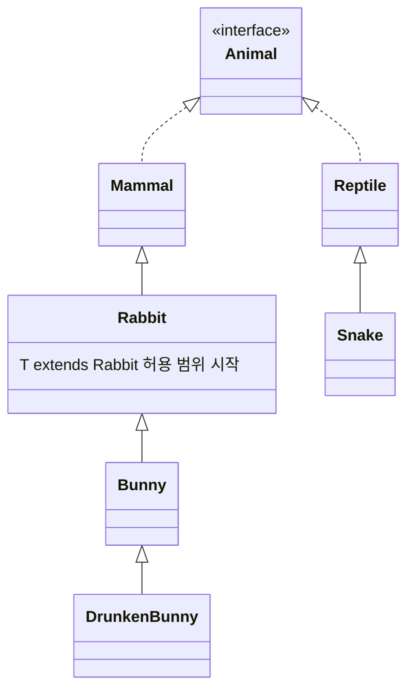

오늘은 제네릭을 배웠다. "타입을 나중에 정한다"는 말이 처음엔 와닿지 않았는데, 직접 아무 타입이나 넣어보고 에러를 내보니 왜 필요한지 알겠더라.

## 1. 제네릭 — 타입을 일반화한다는 것

```java
public class GenericTest<T> {
    private T value;
    public T getValue() { return value; }
    public void setValue(T value) { this.value = value; }
}
```

`<T>`는 **타입 변수**로, 클래스를 쓸 때 실제로 어떤 타입이 들어올지는 나중에(컴파일 시점에) 정한다는 뜻이다. `T`라고 쓰는 건 관례일 뿐 다른 글자를 써도 된다.

```java
GenericTest gt = new GenericTest();  // 타입을 지정하지 않음 (raw type)
gt.setValue(1);
gt.setValue("안녕하세요");  // int든 String이든 다 들어간다 — 위험!

GenericTest<String> gt2 = new GenericTest<>();  // 타입을 String으로 고정
gt2.setValue("문자열");
// gt2.setValue(1);  // 컴파일 에러! String만 받기로 했으니까
```

타입을 지정하지 않으면(raw type) 아무 타입이나 다 들어가 버려서, 나중에 꺼내 쓸 때 무슨 타입인지 몰라 위험하다. `<String>`처럼 타입을 못 박아두면 **컴파일 시점에 미리 걸러줘서** 엉뚱한 타입이 들어오는 걸 막아준다.

다섯 살 아이에게 설명한다면: "제네릭은 '이 상자에는 인형만 넣을 거야'라고 미리 정해두는 거야. 안 정해두면 아무거나(블록, 공, 양말) 다 넣을 수 있는데, 나중에 상자를 열었을 때 뭐가 나올지 몰라서 당황하게 돼."

한 가지 주의할 점: `<>` 안에는 `int`, `char`, `boolean` 같은 **기본 자료형은 못 들어간다.** 대신 그 기본 자료형을 객체로 감싼 **Wrapper 클래스**를 써야 한다.

| 기본 자료형 | Wrapper 클래스 |
|---|---|
| `int` | `Integer` |
| `byte` | `Byte` |
| `short` | `Short` |
| `boolean` | `Boolean` |
| `char` | `Character` |

```java
// GenericTest<int> gt3 = ...;      // 컴파일 에러
GenericTest<Integer> gt3 = new GenericTest<>();  // OK
```

## 2. 한정된 타입 매개변수 — 아무거나 다 받지는 않을 거야

```java
public class RabbitFarm<T extends Rabbit> {
    private T animal;
    public T getAnimal() { return animal; }
    public void setAnimal(T animal) { this.animal = animal; }
}
```

`T extends Rabbit`이라고 써두면, `T` 자리에는 **`Rabbit`이거나 `Rabbit`을 상속받은 클래스만** 들어올 수 있다. 오늘 쓴 동물 클래스들의 관계는 이랬다.



`RabbitFarm<Mammal>`은 컴파일 에러가 난다. `Mammal`은 `Rabbit`의 **부모**라서 `Rabbit`에 포함되지 않기 때문이다. 반대로 `RabbitFarm<Rabbit>`, `RabbitFarm<Bunny>`, `RabbitFarm<DrunkenBunny>`는 전부 `Rabbit` 또는 그 자손이라 가능했다.

## 3. 와일드카드 — 메소드가 받을 수 있는 타입을 제한하기

제네릭 클래스를 메소드의 매개변수로 받을 때는 `?`(와일드카드)로 범위를 조절할 수 있다.

| 문법 | 의미 |
|---|---|
| `RabbitFarm<?>` | 제한 없음 — 아무 타입이나 받는 `RabbitFarm` |
| `RabbitFarm<? extends Bunny>` | 상한 제한 — `Bunny`이거나 `Bunny`의 자식만 |
| `RabbitFarm<? super Bunny>` | 하한 제한 — `Bunny`이거나 `Bunny`의 부모만 |

```java
public void extendsType(RabbitFarm<? extends Bunny> farm) { farm.getAnimal().cry(); }
public void superType(RabbitFarm<? super Bunny> farm) { farm.getAnimal().cry(); }

extendsType(new RabbitFarm<Bunny>(new Bunny()));               // OK
extendsType(new RabbitFarm<DrunkenBunny>(new DrunkenBunny())); // OK (Bunny의 자식)
// extendsType(new RabbitFarm<Rabbit>(new Rabbit()));          // 에러! Rabbit은 Bunny의 부모

superType(new RabbitFarm<Rabbit>(new Rabbit()));   // OK (Bunny의 부모)
superType(new RabbitFarm<Bunny>(new Bunny()));     // OK
// superType(new RabbitFarm<DrunkenBunny>(...));   // 에러! DrunkenBunny는 Bunny의 자식
```

다섯 살 아이에게 설명한다면: "`extends`는 '너보다 어린 동생까지만 끼워줄게'고, `super`는 '너보다 나이 많은 형까지만 끼워줄게'야. 둘 다 너(`Bunny`) 자신은 당연히 끼워주고."


## 오늘의 정리

제네릭은 "어떤 타입을 담을지 미리 정해서 컴파일 시점에 검사받는 것"이었고, 한정된 타입 매개변수(`extends`)는 "그 타입을 특정 범위(상속 관계) 안으로 좁히는 것"이었다. 와일드카드는 거기서 한 걸음 더 나가서, 메소드가 받을 수 있는 타입의 위아래 경계를 `extends`/`super`로 각각 정하는 것이었다.

## 더 학습하면 좋은 개념

- **제네릭 메소드(generic method)** — 오늘은 클래스 전체에 `<T>`를 붙였는데, 메소드 하나에만 자신만의 타입 변수를 붙이는 것도 가능하다.
- **PECS 원칙(Producer-Extends, Consumer-Super)** — 언제 `extends`를 쓰고 언제 `super`를 써야 하는지 정하는 유명한 규칙이다. 오늘 배운 상한/하한 제한을 실전에서 어떻게 선택할지와 바로 연결된다.
- **타입 소거(type erasure)** — 제네릭은 사실 컴파일 시점에만 존재하고, 컴파일이 끝나 바이트코드가 되면 타입 정보가 지워진다고 한다. 왜 기본 자료형을 못 넣는지도 이 개념과 관련이 있다.

## 참고 자료

- [Oracle Java Tutorials - Generics](https://docs.oracle.com/javase/tutorial/java/generics/index.html)
- [Oracle Java Tutorials - Bounded Type Parameters](https://docs.oracle.com/javase/tutorial/java/generics/bounded.html)
- [Oracle Java Tutorials - Wildcards](https://docs.oracle.com/javase/tutorial/java/generics/wildcards.html)
